# Documentation Deploy_LGTM

## Objectif du dossier

Ce dossier documente le projet dans un ordre de lecture progressif: comprendre l'architecture, suivre le deroulement des iterations, exploiter la plateforme, puis durcir et valider l'ensemble.

Le fil conducteur est:

```text
Vision -> Architecture HLD -> Details LLD -> GitOps -> Securite -> Exploitation -> Validation -> Roadmap
```

## Lecture recommandee

### 1. Comprendre le projet

| Document | Role | Niveau |
| --- | --- | --- |
| [01-architecture.md](01-architecture.md) | Vision d'ensemble, composants, hypotheses et decisions structurantes. | HLD |
| [02-roadmap-pilotage.md](02-roadmap-pilotage.md) | Phases projet, criteres de sortie, rituels, indicateurs et risques. | HLD |
| [03-pods-inventory.md](03-pods-inventory.md) | Inventaire des pods utiles au projet et schemas ArgoCD/Traefik/LGTM. | HLD/LLD |

Lecture conseillee pour un nouvel arrivant:

1. [01-architecture.md](01-architecture.md)
2. [02-roadmap-pilotage.md](02-roadmap-pilotage.md)
3. [03-pods-inventory.md](03-pods-inventory.md)

### 2. Comprendre les flux et l'architecture technique

| Document | Role | Niveau |
| --- | --- | --- |
| [04-network-flows.md](04-network-flows.md) | Cartographie HLD/LLD des flux reseau: Grafana, Loki, Mimir, Tempo, Alloy, ArgoCD, Kyverno, Sealed Secrets. | HLD/LLD |
| [adr/](adr/) | Architecture Decision Records: stockage MVP, enforcement Kyverno, Sealed Secrets, NetworkPolicies. | ADR |
| [06-ci-workflows.md](06-ci-workflows.md) | Fonctionnement des controles CI: lint, render, security, sbom. | LLD |
| [05-bootstrap.md](05-bootstrap.md) | Demarrage outillage, Sealed Secrets, kubeseal, bootstrap local. | LLD |

Lecture conseillee avant une modification GitOps:

1. [04-network-flows.md](04-network-flows.md)
2. [adr/](adr/)
3. [06-ci-workflows.md](06-ci-workflows.md)
4. [05-bootstrap.md](05-bootstrap.md)

### 3. Securite et durcissement

| Document | Role | Niveau |
| --- | --- | --- |
| [../SECURITY.md](../SECURITY.md) | Politique securite racine: contribution, secrets, baseline workload, signalement. | Politique |
| [07-security.md](07-security.md) | Regles permanentes: secrets, rotation, controles avant commit, principes de durcissement. | HLD/LLD |
| [08-security-hardening-plan.md](08-security-hardening-plan.md) | Plan SEC-0 avant premiere synchronisation GitOps. | HLD/LLD |
| [09-hardening-audit.md](09-hardening-audit.md) | Audit CIS/K3s/Kubernetes/Kyverno et plan de durcissement progressif. | HLD/LLD |

Lecture conseillee avant enforcement:

1. [07-security.md](07-security.md)
2. [09-hardening-audit.md](09-hardening-audit.md)
3. [08-security-hardening-plan.md](08-security-hardening-plan.md)

### 4. Exploitation et incident

| Document | Role | Niveau |
| --- | --- | --- |
| [10-operations.md](10-operations.md) | Routines d'exploitation, sauvegardes, mise a jour, diagnostic Loki. | LLD |
| [11-troubleshooting.md](11-troubleshooting.md) | Aide au diagnostic et resolution des incidents connus. | LLD |
| [12-validation-checklist.md](12-validation-checklist.md) | Checklist post-deploiement: Git, cluster, GitOps, secrets, LGTM, securite. | Controle |

Lecture conseillee apres deploiement:

1. [12-validation-checklist.md](12-validation-checklist.md)
2. [10-operations.md](10-operations.md)
3. [11-troubleshooting.md](11-troubleshooting.md)

### 5. Historique des iterations

| Document | Role | Niveau |
| --- | --- | --- |
| [reports/90-phase-2.md](reports/90-phase-2.md) | MVP deployable controle: outillage, versions, Terraform minimal, sync waves. | Historique |
| [reports/91-phase-3.md](reports/91-phase-3.md) | Pre-deploiement controle: Sealed Secrets, generation, validation, Git local. | Historique |
| [reports/](reports/) | Rapports de validation et de synchronisation. | Historique |

Lecture conseillee pour comprendre les decisions passees:

1. [reports/90-phase-2.md](reports/90-phase-2.md)
2. [reports/91-phase-3.md](reports/91-phase-3.md)
3. [reports/](reports/)

### 6. Integrations applicatives

| Document | Role | Niveau |
| --- | --- | --- |
| [integrations/01-html-css-js-mysql-lgtm.md](integrations/01-html-css-js-mysql-lgtm.md) | Guide HLD/LLD pour raccorder une application HTML/CSS/JS/MySQL maitrisee a Loki, Mimir, Tempo, Grafana et Alloy. | HLD/LLD |
| [integrations/02-infra-monitoring-lgtm.md](integrations/02-infra-monitoring-lgtm.md) | Guide HLD/LLD generique pour raccorder des equipements infra a Loki, Mimir et Grafana sans versionner les cibles reelles. | HLD/LLD |

Lecture conseillee pour integrer une application test:

1. [04-network-flows.md](04-network-flows.md)
2. [integrations/01-html-css-js-mysql-lgtm.md](integrations/01-html-css-js-mysql-lgtm.md)
3. [integrations/02-infra-monitoring-lgtm.md](integrations/02-infra-monitoring-lgtm.md)
4. [reports/93-application-telemetry-integration-plan.md](reports/93-application-telemetry-integration-plan.md)
5. [reports/94-phase-5-application-telemetry-deployment-plan.md](reports/94-phase-5-application-telemetry-deployment-plan.md)

## Architecture documentaire cible

```mermaid
flowchart TD
  Start[docs/00-README.md] --> HLD[HLD projet]
  HLD --> Arch[01-architecture.md]
  HLD --> Roadmap[02-roadmap-pilotage.md]
  HLD --> Pods[03-pods-inventory.md]

  Start --> LLD[LLD technique]
  LLD --> Flows[04-network-flows.md]
  LLD --> ADR[adr/]
  LLD --> CI[06-ci-workflows.md]
  LLD --> Bootstrap[05-bootstrap.md]

  Start --> Sec[Securite]
  Sec --> Security[07-security.md]
  Sec --> Hardening[08-security-hardening-plan.md]
  Sec --> Audit[09-hardening-audit.md]

  Start --> Ops[Exploitation]
  Ops --> Operations[10-operations.md]
  Ops --> Troubleshooting[11-troubleshooting.md]
  Ops --> Validation[12-validation-checklist.md]

  Start --> History[Historique]
  History --> Phase2[reports/90-phase-2.md]
  History --> Phase3[reports/91-phase-3.md]
  History --> Reports[reports/]

  Start --> Integrations[Integrations applicatives]
  Integrations --> AppLGTM[integrations/01-html-css-js-mysql-lgtm.md]
  Integrations --> InfraLGTM[integrations/02-infra-monitoring-lgtm.md]
  Integrations --> AppReport[reports/93-application-telemetry-integration-plan.md]
  Integrations --> AppDeploy[reports/94-phase-5-application-telemetry-deployment-plan.md]
```



## Parcours par profil

### Architecte

1. [01-architecture.md](01-architecture.md)
2. [04-network-flows.md](04-network-flows.md)
3. [09-hardening-audit.md](09-hardening-audit.md)
4. [02-roadmap-pilotage.md](02-roadmap-pilotage.md)

### Exploitant Kubernetes

1. [03-pods-inventory.md](03-pods-inventory.md)
2. [10-operations.md](10-operations.md)
3. [11-troubleshooting.md](11-troubleshooting.md)
4. [12-validation-checklist.md](12-validation-checklist.md)

### DevSecOps / GitOps

1. [06-ci-workflows.md](06-ci-workflows.md)
2. [07-security.md](07-security.md)
3. [08-security-hardening-plan.md](08-security-hardening-plan.md)
4. [09-hardening-audit.md](09-hardening-audit.md)

### Nouvel integrateur

1. [01-architecture.md](01-architecture.md)
2. [05-bootstrap.md](05-bootstrap.md)
3. [12-validation-checklist.md](12-validation-checklist.md)
4. [10-operations.md](10-operations.md)

### Integrateur applicatif

1. [04-network-flows.md](04-network-flows.md)
2. [integrations/01-html-css-js-mysql-lgtm.md](integrations/01-html-css-js-mysql-lgtm.md)
3. [reports/93-application-telemetry-integration-plan.md](reports/93-application-telemetry-integration-plan.md)
4. [reports/94-phase-5-application-telemetry-deployment-plan.md](reports/94-phase-5-application-telemetry-deployment-plan.md)
5. [12-validation-checklist.md](12-validation-checklist.md)

## Regles de maintien documentaire

- Tout changement GitOps significatif doit mettre a jour au moins un document de conception, d'exploitation ou de validation.
- Toute nouvelle `NetworkPolicy` doit etre refletee dans [04-network-flows.md](04-network-flows.md).
- Toute nouvelle policy Kyverno ou PSA doit etre refletee dans [08-security-hardening-plan.md](08-security-hardening-plan.md) ou [09-hardening-audit.md](09-hardening-audit.md).
- Tout incident resolu doit alimenter [10-operations.md](10-operations.md) ou [11-troubleshooting.md](11-troubleshooting.md).
- Chaque phase importante doit avoir un rapport dans [reports/](reports/) si elle change l'etat du cluster.
- Toute integration applicative doit avoir un guide dans [integrations/](integrations/) et un rapport de planification ou de validation dans [reports/](reports/).
