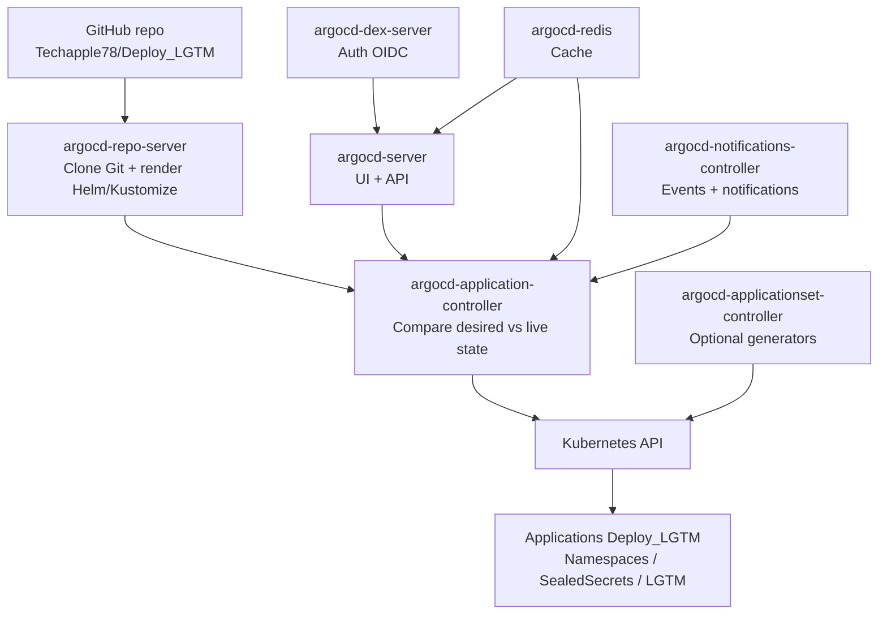
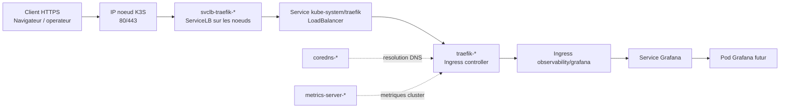
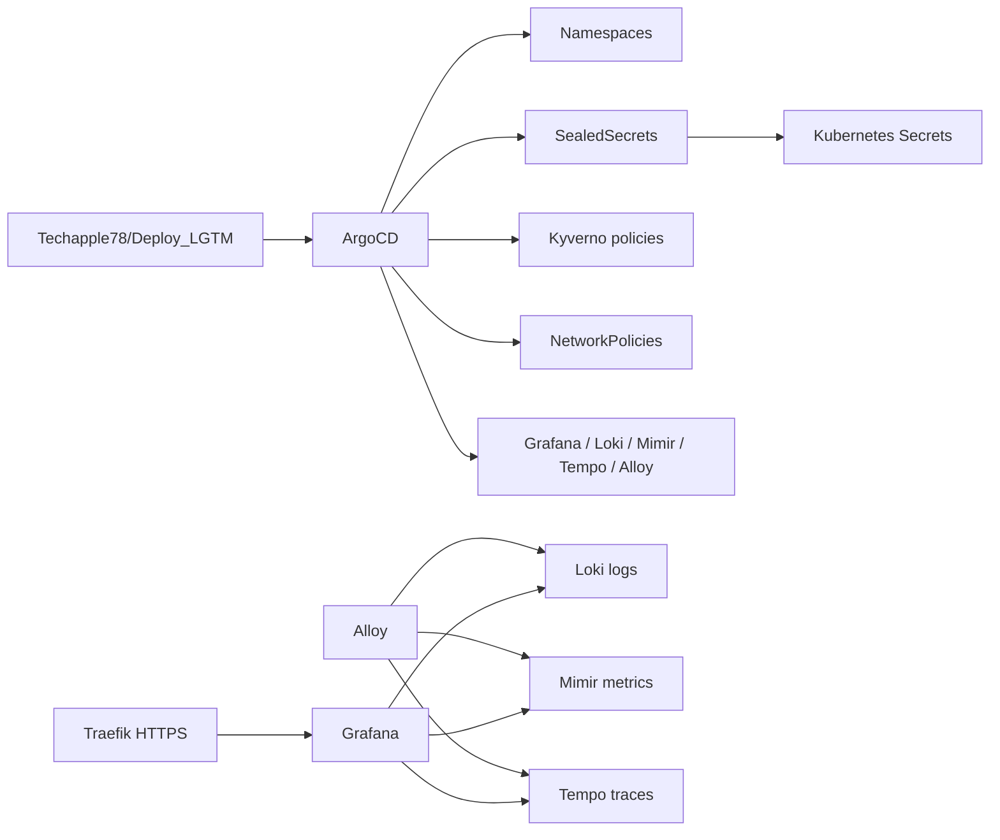
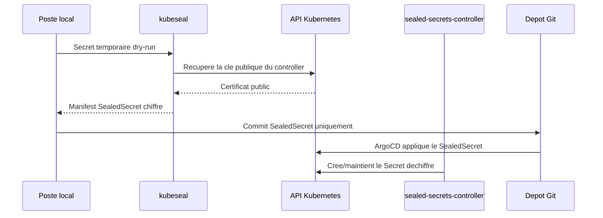

# Inventaire des pods lies a Deploy_LGTM

Date: 2026-07-03

## Perimetre

Ce document ne decrit que les composants utiles au projet `Deploy_LGTM`:

- ArgoCD, moteur GitOps qui synchronisera ce depot.
- Sealed Secrets, gestion des secrets chiffres dans Git.
- Traefik et ServiceLB K3S, exposition HTTP/HTTPS de Grafana.
- Services systeme Kubernetes necessaires au fonctionnement de la stack.
- Les futurs pods LGTM: Grafana, Loki, Mimir, Tempo et Alloy.

Les workloads applicatifs ou observabilite hors projet ne sont pas documentes ici.

## Pods existants directement utiles

Etat observe apres l'iteration 3, avant synchronisation LGTM:

| Namespace | Pod | Role pour Deploy_LGTM | Etat |
| --- | --- | --- | --- |
| `argocd` | `argocd-application-controller-0` | Reconciliation des `Application` ArgoCD depuis Git vers Kubernetes. | Running |
| `argocd` | `argocd-applicationset-controller-*` | Gestion des ApplicationSets si le projet en introduit plus tard. | Running |
| `argocd` | `argocd-dex-server-*` | Authentification OIDC interne ArgoCD. | Running |
| `argocd` | `argocd-notifications-controller-*` | Notifications ArgoCD. | Running |
| `argocd` | `argocd-redis-*` | Cache et stockage temporaire ArgoCD. | Running |
| `argocd` | `argocd-repo-server-*` | Clone le depot, rend Helm/Kustomize/manifests. | Running |
| `argocd` | `argocd-server-*` | API et interface web ArgoCD. | Running |
| `kube-system` | `sealed-secrets-controller-*` | Dechiffre les `SealedSecret` versionnes en `Secret` Kubernetes. | Running |
| `kube-system` | `traefik-*` | Ingress controller qui exposera Grafana. | Running |
| `kube-system` | `svclb-traefik-*` | Pods ServiceLB K3S qui publient Traefik sur les noeuds. | Running |
| `kube-system` | `local-path-provisioner-*` | Provisionnement PVC par defaut si aucune StorageClass vSphere n'est choisie. | Running |
| `kube-system` | `metrics-server-*` | Metriques Kubernetes de base. | Running |
| `kube-system` | `coredns-*` | Resolution DNS interne du cluster. | Running |

## Fonctionnement ArgoCD avec les pods existants

Lecture:

- `argocd-repo-server` recupere le depot GitHub et rend les sources.
- `argocd-application-controller` compare l'etat Git avec l'etat du cluster.
- `argocd-server` expose l'UI/API pour observer et piloter.
- `argocd-redis` accelere/cache certaines operations internes.
- `argocd-dex-server` gere l'authentification ArgoCD.
- `argocd-notifications-controller` envoie les notifications si configure.
- `argocd-applicationset-controller` est disponible pour une evolution future, mais le MVP utilise surtout app-of-apps.

## Fonctionnement Traefik avec les pods kube-system

Lecture:

- K3S installe Traefik comme Ingress controller par defaut.
- `svclb-traefik-*` est cree par ServiceLB K3S pour exposer le service Traefik sur les noeuds.
- Le futur `Ingress` Grafana pointera vers le service Grafana dans `observability`.
- Le TLS public de Grafana dependra du secret `observability/grafana-tls` ou d'une strategie cert-manager/ACME future.

## Fonctionnement cible Deploy_LGTM

## Flux Sealed Secrets

## Pods attendus apres synchronisation LGTM

| Composant | Type attendu | Role |
| --- | --- | --- |
| Grafana | Deployment/Pod | UI, dashboards, datasources. |
| Loki | Pods chart Loki | Stockage et requetes logs. |
| Mimir | Pods chart Mimir | Stockage et requetes metriques. |
| Tempo | Deployment/Pod | Traces distribuees. |
| Alloy | DaemonSet | Collecte logs, metriques et traces. |
| Kyverno | Deployments | Admission policies en mode Audit. |

## Points d'attention

- `Deploy_LGTM` n'est pas encore synchronise par ArgoCD tant que l'app-of-apps n'a pas ete appliquee.
- La cle privee Sealed Secrets du cluster doit etre sauvegardee hors Git.
- Les NetworkPolicies sont versionnees, mais leur enforcement depend du CNI installe.
- Le prochain deploiement reel sera la synchronisation ArgoCD de `Deploy_LGTM`.
