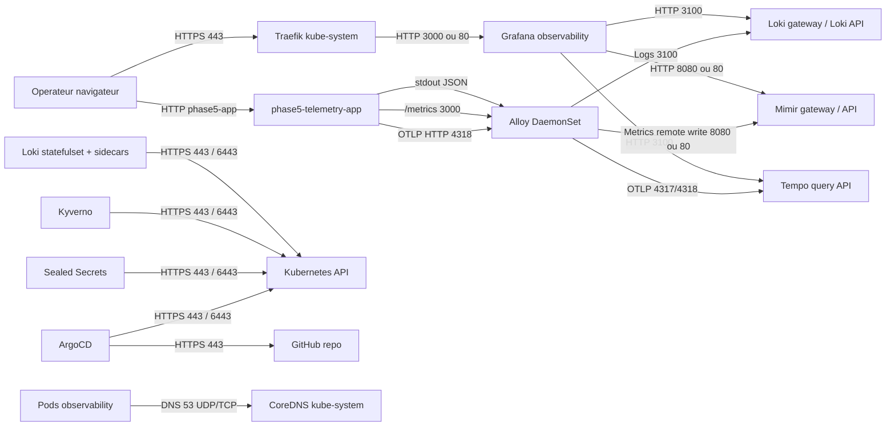

# HLD/LLD - Flux reseau Deploy_LGTM

## Objectif

Ce document explique les flux reseau attendus autour de la stack LGTM et leur lien avec les `NetworkPolicy`. Il sert a verifier l'exhaustivite avant tout durcissement plus strict.

## HLD - Vue logique

### Intention d'architecture

La stack est separee en cinq zones logiques:

| Zone | Role | Principe de securite |
| --- | --- | --- |
| Entree utilisateur | Acces operateur a Grafana via Traefik. | Exposer uniquement Grafana en HTTPS. |
| GitOps | ArgoCD lit Git et applique l'etat desire. | Flux privilegie vers API Kubernetes, pas d'acces direct aux secrets en clair dans Git. |
| Observabilite | Grafana, Loki, Mimir, Tempo, Alloy. | Default deny puis allowlist par flux metier. |
| Admission et secrets | Kyverno, PSA, Sealed Secrets. | Controle admission et decryptage runtime des secrets. |
| Tests Phase 5 | Application `phase5-telemetry-app`. | Validation controlee logs, metriques et traces OTLP. |
| Services cluster | API Kubernetes, CoreDNS, Traefik, ServiceLB, registry, NTP. | Flux de plateforme minimaux et explicites. |

### Diagramme HLD

### Regle de lecture

Un flux n'est accepte que s'il a:

- une source identifiee;
- une destination identifiee;
- un port/protocole connu;
- une justification fonctionnelle;
- une decision de controle: autorise, a observer, ou a bloquer.

## LLD - Flux detailles

### Matrice de synthese

| Flux | Source | Destination | Port/protocole | Etat policy |
| --- | --- | --- | --- | --- |
| Acces Grafana | Traefik | Grafana | TCP 3000/80 cote service | Couvert |
| Datasource logs | Grafana | Loki | TCP 3100/80 | Couvert |
| Datasource metriques | Grafana | Mimir | TCP 8080/80 | Couvert |
| Datasource traces | Grafana | Tempo | TCP 3100 | Couvert |
| Logs | Alloy | Loki | TCP 3100/80 | Couvert |
| Metriques | Alloy | Mimir | TCP 8080/80 | Couvert |
| Traces | Alloy | Tempo | TCP 4317/4318/3100 | Couvert |
| Phase 5 ingress | Traefik | phase5-telemetry-app | TCP 3000 | Couvert |
| Phase 5 logs | phase5-telemetry-app | Alloy | stdout Kubernetes | Couvert |
| Phase 5 metriques | Alloy | phase5-telemetry-app | TCP 3000 `/metrics` | Couvert |
| Phase 5 traces OTLP | phase5-telemetry-app | Alloy | TCP 4318 | Couvert |
| Discovery Kubernetes | Alloy | API Kubernetes | TCP 443/6443 | Couvert |
| Regles Loki | Loki sidecar | API Kubernetes | TCP 443/6443 | Couvert |
| DNS | Pods observability | CoreDNS | UDP/TCP 53 | Couvert |
| Mimir interne | Mimir components | Mimir components | Selon chart | A observer |
| Loki canary | Loki canary | Loki | TCP 3100/80 | A observer |
| ArgoCD Git | ArgoCD repo-server | GitHub | TCP 443 | Hors observability |
| Kyverno admission | Kyverno | API Kubernetes | TCP 443/6443 | Hors observability |
| Sealed Secrets | Controller | API Kubernetes | TCP 443/6443 | Hors observability |

### Flux Mimir internes

Mimir est compose de plusieurs services specialises. Selon le mode de deploiement Helm, les composants peuvent etre separes en `distributor`, `ingester`, `querier`, `query-frontend`, `query-scheduler`, `store-gateway`, `compactor`, `gateway` et `overrides-exporter`.

| Source | Destination | Role | Sens securite |
| --- | --- | --- | --- |
| `mimir-gateway` | composants Mimir internes | Point d'entree HTTP interne pour les clients. | Doit accepter Grafana et Alloy, pas une exposition publique directe. |
| `mimir-distributor` | `mimir-ingester` | Recoit les ecritures Prometheus remote write et distribue les series. | Flux critique d'ingestion. |
| `mimir-query-frontend` | `mimir-querier` | Decoupe et met en file les requetes de lecture. | Flux critique de consultation. |
| `mimir-querier` | `mimir-store-gateway` / `mimir-ingester` | Lit les blocs historiques et les donnees recentes. | Necessaire aux dashboards Grafana. |
| `mimir-compactor` | stockage Mimir | Compacte et nettoie les blocs. | Flux stockage, sensible aux droits PVC/objet. |
| `mimir-overrides-exporter` | API Mimir | Expose les limites et overrides. | Utile pour l'observabilite de Mimir. |

Etat NetworkPolicy actuel: les flux `Grafana -> Mimir` et `Alloy -> Mimir` sont couverts. Les flux internes Mimir ne sont pas encore modelises finement par policy dediee. C'est acceptable pour le MVP si les pods restent fonctionnels, mais ce n'est pas une exhaustivite production.

### Flux Loki internes

Loki recoit les logs, les indexe et les expose en requete LogQL. Le chart deploie aussi des composants auxiliaires comme gateway, canary et sidecar de regles.

| Source | Destination | Role | Sens securite |
| --- | --- | --- | --- |
| `alloy` | `loki` / `loki-gateway` | Envoi des logs collectes sur les noeuds. | Flux d'ingestion principal. |
| `grafana` | `loki` / `loki-gateway` | Requetes LogQL depuis les dashboards. | Flux de lecture principal. |
| `loki-canary` | `loki` / `loki-gateway` | Test d'ingestion et de lecture. | Flux de controle de sante. |
| `loki-sc-rules` | API Kubernetes | Lit `ConfigMap` et `Secret` labels `loki_rule`. | Necessite une egress API malgre le default deny. |
| `loki` | PVC / stockage local | Stocke index, chunks et WAL selon configuration. | Sensible a la reprise apres coupure. |

Etat NetworkPolicy actuel: `Grafana -> Loki`, `Alloy -> Loki`, DNS et `Loki -> API Kubernetes` sont couverts. Les flux `loki-canary -> Loki` et les flux internes exacts du chart doivent etre ajoutes si l'on veut une isolation stricte pod-a-pod.

### Flux Tempo internes

Tempo recoit les traces OTLP et les rend consultables par Grafana. Le deploiement actuel est simple, mais la topologie peut evoluer vers des composants separes.

| Source | Destination | Role | Sens securite |
| --- | --- | --- | --- |
| `alloy` | `tempo` | Envoi des traces OTLP gRPC/HTTP. | Flux d'ingestion traces. |
| `grafana` | `tempo` | Recherche et affichage des traces. | Flux de lecture. |
| composants Tempo futurs | composants Tempo futurs | Distributor, ingester, querier, compactor selon architecture future. | A documenter si passage en mode distribue. |

Etat NetworkPolicy actuel: `Alloy -> Tempo` et `Grafana -> Tempo` sont couverts. Aucun flux interne Tempo complexe n'est requis tant que la topologie reste simple.

### Flux Phase 5 telemetry

La Phase 5 ajoute une application temoin maitrisee pour tester la chaine LGTM de bout en bout sans dependre d'une application tierce non maintenue.

| Source | Destination | Role | Sens securite |
| --- | --- | --- | --- |
| `traefik` | `phase5-telemetry-app` | Acces navigateur ou test HTTP. | Exposition controlee via Ingress. |
| `phase5-telemetry-app` | stdout Kubernetes | Logs JSON applicatifs. | Collecte par Alloy via discovery Kubernetes. |
| `alloy` | `phase5-telemetry-app` | Scrape Prometheus `/metrics`. | Validation Mimir et dashboard Phase 5. |
| `phase5-telemetry-app` | `alloy` | Export OTLP/HTTP traces. | Validation Tempo via Alloy. |
| `phase5-telemetry-app` | CoreDNS | Resolution DNS vers Alloy. | Necessaire au service discovery. |
| `alloy` | API Kubernetes | Decouverte des pods et collecte des logs Kubernetes. | Necessaire aux logs applicatifs dans Loki. |

Etat NetworkPolicy actuel: le namespace `phase5-telemetry` est en default deny. Les policies autorisent DNS, Traefik vers l'application, Alloy vers `/metrics` et l'application vers Alloy en OTLP/HTTP 4318. Le namespace `observability` autorise reciproquement Alloy a recevoir OTLP, a scraper les metriques Phase 5 et a joindre l'API Kubernetes pour la collecte des logs de pods.

### Flux ArgoCD

ArgoCD est le moteur GitOps. Il a besoin de deux axes reseau principaux: acces au depot Git et acces a l'API Kubernetes.

| Source | Destination | Role | Sens securite |
| --- | --- | --- | --- |
| `argocd-repo-server` | GitHub | Clone le depot et recupere les sources Helm/Kustomize. | Sortie Internet ou proxy necessaire. |
| `argocd-application-controller` | API Kubernetes | Compare et applique l'etat desire. | Flux privilegie, RBAC critique. |
| `argocd-server` | API Kubernetes / Redis / Dex | UI/API, auth et cache. | A durcir si exposition externe. |
| `argocd-notifications-controller` | endpoints de notification | Notifications optionnelles. | Flux sortant a autoriser seulement si utilise. |

Etat NetworkPolicy actuel: le namespace `argocd` n'est pas encore soumis a un default deny specifique dans ce depot. Le durcissement ArgoCD doit etre traite separement, car un blocage reseau peut casser la reconciliation GitOps.

### Flux Kyverno vers API Kubernetes

Kyverno fonctionne comme controleur d'admission et moteur de scan.

| Source | Destination | Role | Sens securite |
| --- | --- | --- | --- |
| `kyverno-admission-controller` | API Kubernetes | Recoit les AdmissionReview et valide les objets. | Critique pour enforcement. |
| `kyverno-background-controller` | API Kubernetes | Scanne les ressources existantes. | Necessaire aux PolicyReports. |
| `kyverno-reports-controller` | API Kubernetes | Produit les rapports de conformite. | Necessaire au suivi Audit. |
| `kyverno-cleanup-controller` | API Kubernetes | Nettoyage si policies associees. | Selon configuration. |

Etat NetworkPolicy actuel: pas de default deny dedie au namespace `kyverno`. Avant d'en ajouter un, il faut autoriser explicitement l'API Kubernetes et les webhooks Kyverno.

### Flux Sealed Secrets vers API Kubernetes

Sealed Secrets transforme les `SealedSecret` chiffres stockes dans Git en `Secret` Kubernetes.

| Source | Destination | Role | Sens securite |
| --- | --- | --- | --- |
| `sealed-secrets-controller` | API Kubernetes | Observe les `SealedSecret`, cree et maintient les `Secret`. | Flux indispensable au decryptage runtime. |
| poste operateur `kubeseal` | API Kubernetes | Recupere le certificat public du controller. | Flux ponctuel depuis le poste d'administration. |
| ArgoCD | API Kubernetes | Applique les manifests `SealedSecret`. | Ne manipule pas la cle privee. |

Etat NetworkPolicy actuel: Sealed Secrets est dans `kube-system`, hors default deny `observability`. Un durcissement `kube-system` demande une grande prudence car il touche les composants coeur K3S.

### Flux sortants eventuels

| Destination | Qui l'utilise | Pourquoi | Decision recommandee |
| --- | --- | --- | --- |
| Registry OCI | kubelet/containerd | Pull des images Grafana, Loki, Mimir, Tempo, Alloy, Kyverno. | Autoriser au niveau noeuds/proxy, pas forcement par NetworkPolicy pod. |
| GitHub | ArgoCD / CI | GitOps et workflows. | Autoriser ArgoCD uniquement si pas de miroir interne. |
| DNS externe | CoreDNS | Resolution vers Internet. | Controler via DNS/proxy d'entreprise si possible. |
| NTP | noeuds | Horloge fiable pour TLS, logs, certificats. | Gerer au niveau OS/noeuds. |
| ACME / cert-manager | cert-manager ou Traefik | Emission TLS automatique. | Autoriser seulement si ACME retenu. |

## LLD - Exhaustivite actuelle

Les NetworkPolicies actuelles couvrent les flux critiques du MVP dans `observability`:

- default deny ingress/egress;
- DNS pour les pods;
- Traefik vers Grafana;
- Grafana vers Loki, Mimir et Tempo;
- Alloy vers Loki, Mimir et Tempo;
- Phase 5 vers Alloy OTLP et Alloy vers metriques Phase 5;
- Loki vers l'API Kubernetes pour son sidecar de regles.

Elles ne couvrent pas encore de facon exhaustive:

- les flux internes fins entre composants Mimir;
- les flux `loki-canary` et certains flux internes Loki;
- le durcissement reseau des namespaces `argocd`, `kyverno` et `kube-system`;
- les sorties GitHub, registry, NTP, ACME, qui se pilotent souvent au niveau firewall/proxy/noeud.

Conclusion: l'exhaustivite est suffisante pour le MVP LGTM, mais pas encore pour un mode production strict. La prochaine etape consiste a observer les connexions reelles, puis a ajouter des policies par composant avant de generaliser le default deny aux autres namespaces.

## HLD vers LLD - Decisions de durcissement

| Decision HLD | Traduction LLD | Statut |
| --- | --- | --- |
| Exposer uniquement Grafana | Ingress Traefik vers service Grafana | En place |
| Isoler `observability` | `observability-default-deny` | En place |
| Autoriser les flux metier LGTM | Policies Grafana/Alloy vers backends | En place |
| Autoriser les dependances plateforme | DNS et API Kubernetes pour Loki | En place |
| Ne pas durcir brutalement `kube-system` | Cartographie requise avant default deny | A faire |
| Ne pas casser GitOps | Cartographie ArgoCD avant default deny | A faire |
| Passer production stricte | Ajouter flux internes Mimir/Loki/Tempo observes | A faire |

## Sources

- Kubernetes Network Policies: https://kubernetes.io/docs/concepts/services-networking/network-policies/
- K3s Networking Services: https://docs.k3s.io/networking/networking-services
- K3s CIS Hardening Guide: https://docs.k3s.io/security/hardening-guide
