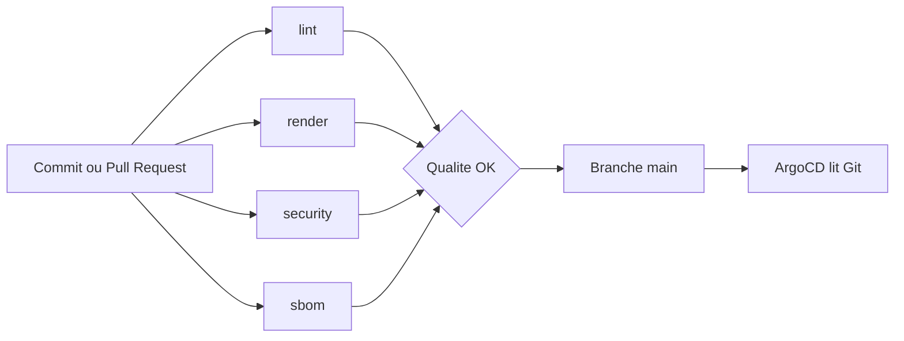
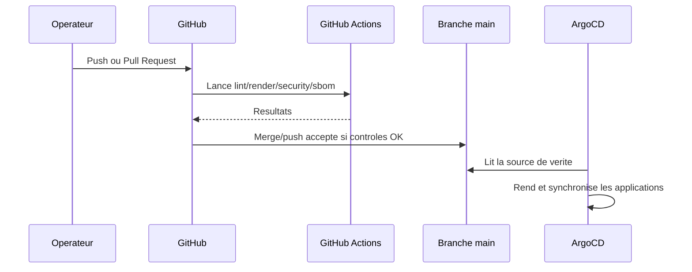

# Fonctionnement des workflows CI

## Objectif

Les workflows GitHub Actions protegent le depot avant toute synchronisation ArgoCD. Ils ne deploient rien sur le cluster. Leur role est de bloquer les erreurs de forme, les manifests invalides, les fuites de secrets et les risques de dependances avant que Git devienne la source de verite du cluster.

## Vue d'ensemble



Tous les workflows se declenchent sur:

- `pull_request`
- `push` vers `main`

## Workflow `lint`

Fichier:

```text
.github/workflows/lint.yml
```

Role:

- Verifier la lisibilite et la coherence des fichiers YAML.
- Detecter indentation incorrecte, YAML invalide, erreurs de style bloquantes.

Outil:

- `ibiqlik/action-yamllint@v3`
- Configuration: `.yamllint.yml`

Ce que `lint` ne fait pas:

- Il ne sait pas si un YAML est un manifest Kubernetes valide.
- Il ne rend pas les charts Helm.
- Il ne contacte pas le cluster.

Echec typique:

- indentation YAML incorrecte;
- caractere special mal echappe;
- structure YAML non parseable.

Correction:

1. Ouvrir le fichier indique dans le log.
2. Corriger la forme YAML.
3. Relancer la CI ou pousser un commit correctif.

## Workflow `render`

Fichier:

```text
.github/workflows/render.yml
```

Role:

- Verifier les manifests Kubernetes locaux.
- Rendre les charts Helm LGTM avec les `values.yaml` du depot.
- Valider les YAML generes par Helm.

Jobs:

| Job | Role |
| --- | --- |
| `validate-manifests` | Valide les manifests Kubernetes versionnes avec `kubeconform`. |
| `render-helm` | Rend Grafana, Loki, Mimir, Tempo et Alloy avec Helm puis valide le rendu. |

Outils:

- `kubectl` via `azure/setup-kubectl@v4`
- `helm` via `azure/setup-helm@v4`
- `kubeconform v0.6.7`

Details importants:

- Les fichiers `platform/lgtm/*/values.yaml` sont exclus de la validation Kubernetes directe, car ce sont des values Helm, pas des manifests Kubernetes.
- Ils sont valides indirectement par `helm template`.
- `kubeconform` utilise `-ignore-missing-schemas` pour accepter les CRD ArgoCD/Kyverno/SealedSecrets dont les schemas ne sont pas toujours presents par defaut.

Echec typique:

- chart Helm incompatible avec nos values;
- champ Kubernetes invalide;
- YAML rendu invalide;
- version de chart inexistante.

Correction:

1. Lire quel job echoue: `validate-manifests` ou `render-helm`.
2. Si c'est un manifest local, corriger le fichier YAML.
3. Si c'est Helm, corriger le `values.yaml` ou la version du chart.

Equivalent local:

```powershell
powershell.exe -NoProfile -ExecutionPolicy Bypass -File .\scripts\Test-Repository.ps1
```

## Workflow `security`

Fichier:

```text
.github/workflows/security.yml
```

Role:

- Detecter les secrets accidentellement commites.
- Scanner les configurations IaC/Kubernetes/Terraform pour risques critiques.

Jobs:

| Job | Outil | Role |
| --- | --- | --- |
| `secret-scan` | `gitleaks/gitleaks-action@v3.0.0` | Recherche secrets, tokens, cles privees dans l'historique checkout. |
| `filesystem-scan` | `aquasecurity/trivy-action@v0.36.0` | Scan config/IaC avec severite `HIGH,CRITICAL`. |

Configuration:

- `.gitleaks.toml` ignore uniquement les manifests `secrets/sealed/*.sealedsecret.yaml`.
- Ces fichiers contiennent des donnees chiffrees `SealedSecret`, attendues comme haute entropie.
- Les autres chemins restent scannes.

Ce que `security` bloque:

- secret clair detecte;
- fichier sensible non ignore;
- mauvaise configuration critique detectee par Trivy.

Ce que `security` ne remplace pas:

- revue humaine des SealedSecrets;
- rotation de secrets;
- verification runtime dans le cluster;
- sauvegarde de la cle privee Sealed Secrets.

Echec typique:

- `.tfvars` sensible ajoute par erreur;
- cle privee commitee;
- token dans un exemple;
- configuration Kubernetes dangereuse.

Correction:

1. Supprimer le secret du fichier.
2. Si le secret a ete pousse, le considerer compromis.
3. Rotater le secret.
4. Regenerer le SealedSecret.

## Workflow `sbom`

Fichier:

```text
.github/workflows/sbom.yml
```

Role:

- Generer une SBOM du depot.
- Scanner les dependances et fichiers du depot avec Trivy.

Jobs:

| Job | Outil | Role |
| --- | --- | --- |
| `generate-sbom` | `anchore/sbom-action@v0.24.0` | Genere `deploy-lgtm.spdx.json`. |
| `dependency-scan` | `aquasecurity/trivy-action@v0.36.0` | Scan filesystem avec severite `HIGH,CRITICAL`. |

Artefact produit:

```text
deploy-lgtm-sbom
```

Format:

```text
SPDX JSON
```

Utilite:

- tracer les composants du depot;
- aider les audits;
- preparer la future gouvernance supply chain;
- fournir une base pour scans de dependances.

Limite actuelle:

- Le depot ne construit pas encore d'image applicative LGTM interne.
- La SBOM couvre le contenu du repo, pas les images tierces des charts Grafana.
- Une phase ulterieure devra ajouter SBOM et signature pour les images internes si le projet en construit.

## Chaine de controle avant ArgoCD



## Politique de blocage

| Workflow | Bloquant avant merge/push main | Raison |
| --- | --- | --- |
| `lint` | Oui | Evite les erreurs YAML basiques. |
| `render` | Oui | Evite les manifests ou charts non applicables. |
| `security` | Oui | Evite fuite de secrets et mauvaises configs critiques. |
| `sbom` | Oui | Impose une hygiene supply chain minimale. |

## Exploitation des echecs

Commandes utiles:

```powershell
gh run list --repo Techapple78/Deploy_LGTM --limit 10
gh run view <run-id> --repo Techapple78/Deploy_LGTM --log-failed
```

Regle d'analyse:

1. Corriger d'abord `lint`.
2. Corriger ensuite `render`.
3. Corriger `security` sans contourner le signal.
4. Corriger `sbom` ou documenter l'exception si un faux positif est confirme.

## Lien avec SEC-0

Ces workflows sont le premier niveau de defense. Les controles runtime viennent ensuite:

- Pod Security Admission;
- Kyverno;
- NetworkPolicies;
- Sealed Secrets;
- ArgoCD drift detection.

La CI empeche d'envoyer du contenu manifestement risqué vers Git. ArgoCD et Kubernetes controlent ensuite ce qui se passe dans le cluster.
