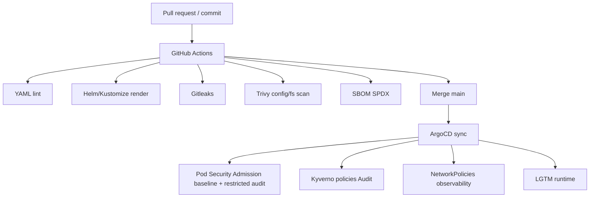

# Iteration SEC-0 - Durcissement avant iteration 4

## Objectif

Preparer les garde-fous de securite avant la premiere synchronisation GitOps LGTM. L'objectif est d'augmenter le niveau de controle sans bloquer le MVP avec des politiques trop strictes des le premier deploiement.

## Principes

- Tout ce qui peut casser un chart tiers commence en `Audit`.
- Les controles CI bloquants sont actives avant les controles admission bloquants.
- Les secrets restent sous Sealed Secrets uniquement.
- Les commandes mutables cluster restent reservees a l'iteration 4.

## Axes de durcissement

### TLS partout

Etat actuel:

- Traefik expose deja HTTP/HTTPS au niveau cluster K3S.
- L'Ingress Grafana cible HTTPS avec `grafana-tls`.
- Le secret TLS reel n'est pas encore fourni.

Plan SEC-0:

1. Garder Grafana derriere Traefik HTTPS.
2. Documenter le secret attendu `observability/grafana-tls`.
3. Decider entre certificat manuel, cert-manager ou ACME Traefik.
4. Ne pas exposer Loki, Mimir, Tempo ou Alloy publiquement.

Critere avant iteration 4:

- Domaine Grafana confirme.
- Strategie TLS choisie.

### Pod Security Admission

Etat actuel:

- `observability`, `argocd` et `kyverno` sont etiquetes en `enforce=baseline`, `audit=restricted`, `warn=restricted`.

Plan SEC-0:

1. Demarrer en `baseline` pour eviter de bloquer les charts.
2. Lire les warnings `restricted` apres rendu et deploiement.
3. Corriger les values Helm compatibles.
4. Passer `observability` en `restricted` seulement apres validation.

Critere avant enforcement:

- Aucun pod LGTM critique ne viole `restricted`.

### NetworkPolicies

Etat actuel:

- Des NetworkPolicies GitOps sont ajoutees dans `platform/security/network-policies`.
- Elles ne seront efficaces que si le CNI du cluster applique les NetworkPolicies.
- K3S avec Flannel seul ne les applique pas; il faut verifier le CNI reel.

Plan SEC-0:

1. Ajouter default deny dans `observability`.
2. Autoriser DNS.
3. Autoriser Traefik vers Grafana.
4. Autoriser Grafana et Alloy vers les backends LGTM.
5. Ajuster apres observation des labels reels des charts.

Critere avant iteration 4:

- Confirmer si le CNI applique les NetworkPolicies.
- Accepter que les policies soient versionnees mais potentiellement non enforcees si le CNI ne les supporte pas.

### Signature d'images

Etat actuel:

- Les images des charts tiers ne sont pas controlees par nous.
- Un enforcement global casserait probablement le MVP.

Plan SEC-0:

1. Ajouter un exemple Kyverno `verifyImages` pour les futures images internes.
2. Garder la verification en `Audit`.
3. Signer les images internes futures avec Cosign keyless GitHub Actions.
4. Ne pas exiger de signature pour les images tierces tant que les attestors ne sont pas confirmes.

Critere avant enforcement:

- Images internes signees.
- Politique Kyverno testee en Audit.
- Exceptions documentees pour images tierces.

### SBOM et dependances

Etat actuel:

- Trivy config scan existe.
- Gitleaks existe.

Plan SEC-0:

1. Ajouter generation SBOM SPDX en GitHub Actions.
2. Ajouter scan de vulnerabilites filesystem avec Trivy.
3. Conserver les artefacts SBOM dans les runs CI.
4. Etendre plus tard aux images OCI quand des images internes seront construites.

Critere avant iteration 4:

- Workflow SBOM present.
- Workflow security present.
- Validation locale `scripts/Test-Repository.ps1` verte.

## Schema de controle

## Backlog SEC-0

| Item | Statut | Notes |
| --- | --- | --- |
| Corriger repoURL vers `Techapple78/Deploy_LGTM` | Fait | Evite un sync ArgoCD vers un depot inexistant. |
| Ajouter NetworkPolicies observability | Fait | A verifier selon CNI. |
| Ajouter policies Kyverno Audit | Fait | Pas d'enforcement avant observation. |
| Ajouter SBOM CI | Fait | Artefact SPDX. |
| Ajouter exemple signature images | Fait | Non applique par ArgoCD. |
| Choisir strategie TLS Grafana | A decider | Bloquant pour exposition propre. |
| Sauvegarder cle privee Sealed Secrets | A decider | Critique avant production. |

## Decision Go/No-Go vers iteration 4

Go si:

- Depot GitHub pousse.
- CI verte.
- SealedSecrets presents.
- Strategie TLS choisie.
- Le risque NetworkPolicy/CNI est compris.

No-Go si:

- Secrets en clair detectes.
- RepoURL ArgoCD incorrect.
- Sealed Secrets non operationnel.
- Aucun rollback GitOps documente.
