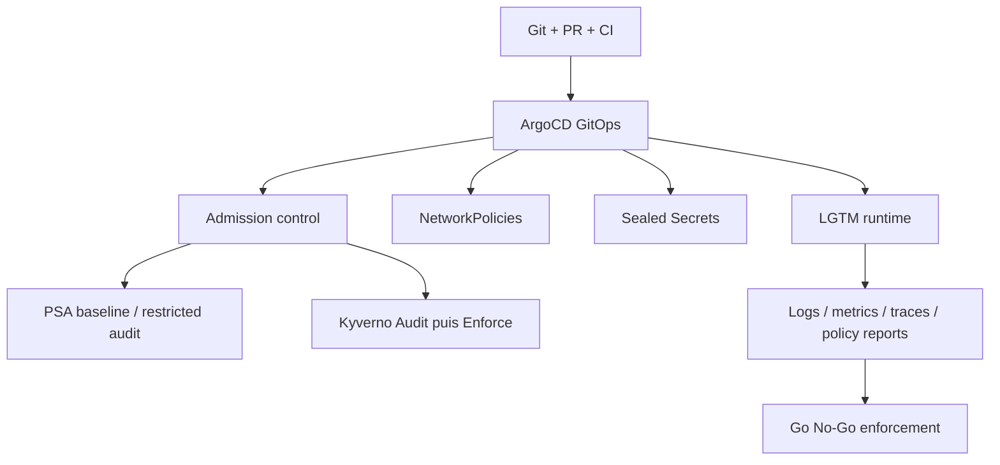

# HLD/LLD - Audit de durcissement Deploy_LGTM

## Portee

Audit documentaire de l'etat actuel du projet `Deploy_LGTM`, sans modification des manifests d'enforcement. L'audit s'appuie sur:

- les manifests GitOps du depot;
- les politiques Kyverno en `Audit`;
- les labels Pod Security Admission;
- les NetworkPolicies `observability`;
- les recommandations Kubernetes, K3s/CIS et Kyverno.

Ce document ne remplace pas un scan runtime complet du cluster. Il donne un plan de durcissement progressif.

## Score de maturite

Ce score est une estimation pedagogique issue de l'audit documentaire et des scans statiques du depot. Il ne constitue pas un score officiel CIS, ANSSI ou K3S, car aucun calculateur runtime complet n'a encore ete execute sur les noeuds et le control plane.

```text
Hardening maturity score: 62/100
Niveau: MVP securise / pre-production
Statut: acceptable pour lab controle, insuffisant pour production exposee
```

Le score devra etre recalcule apres execution d'un audit runtime avec un outil adapte, par exemple `kube-bench`, CIS-CAT Pro ou le K3S CIS Self Assessment.

## HLD - Objectif de securite

L'objectif HLD est de rendre la plateforme LGTM exploitable sans ouvrir plus que necessaire:

- Git est la source de verite;
- ArgoCD applique les changements;
- les secrets ne sont jamais stockes en clair dans Git;
- les workloads sont bloques au minimum `baseline` et observes en `restricted`;
- le namespace `observability` fonctionne en default deny;
- les controles bloquants arrivent apres observation et remediation.

## HLD - Domaines de controle



## LLD - Controles observes

| Controle | Implementation actuelle | Niveau de confiance |
| --- | --- | --- |
| Source de verite | Depot GitHub `Techapple78/Deploy_LGTM` | Bon |
| Validation CI | lint, render, security, sbom | Bon |
| Secrets Git | `SealedSecret` uniquement | Bon |
| Admission native | PSA `baseline` enforce, `restricted` audit/warn | Bon MVP |
| Admission Kyverno | ClusterPolicies en `Audit` | Bon MVP |
| Isolation reseau | Default deny `observability` + allowlist | Partiel solide |
| Exposition | Traefik vers Grafana | Bon si TLS effectif |
| Audit runtime | A consolider via Kyverno reports et logs API | Partiel |

## References de controle

| Reference | Ce qu'elle apporte | Impact pour Deploy_LGTM |
| --- | --- | --- |
| Kubernetes Pod Security Standards | Profils `baseline` et `restricted` pour les pods. | Base PSA et Kyverno. |
| Kubernetes NetworkPolicy | Isolation ingress/egress par pod, appliquee par le plugin reseau. | Modele default deny + allowlist. |
| K3s CIS Hardening Guide | Guidance CIS adaptee a K3s: PSA, NetworkPolicies, audit logs, OS host. | Roadmap hardening cluster. |
| Kyverno | Admission policy: `Audit` ou `Enforce`, PolicyReports, validations YAML. | Controle fin avant blocage. |

## HLD - Synthese executive

| Domaine | Etat actuel | Niveau | Recommandation |
| --- | --- | --- | --- |
| GitOps | ArgoCD applique le depot et les apps sont versionnees. | Bon MVP | Continuer PR + CI + sync controlee. |
| Secrets | Sealed Secrets utilise, sauvegarde externe de la cle faite. | Bon | Definir cadence de test restauration et rotation exceptionnelle. |
| PSA | Namespaces en `enforce=baseline`, `audit/warn=restricted`. | Bon compromis | Corriger les warnings avant `restricted`. |
| Kyverno | Policies en `Audit`. | Bon pour observation | Passer en `Enforce` progressivement apres remediation. |
| NetworkPolicies | Default deny et allowlist dans `observability`. | Partiel solide | Completer flux internes LGTM et autres namespaces. |
| TLS | Grafana prevu derriere Traefik HTTPS. | A confirmer | Verifier secret TLS/cert-manager/ACME retenu. |
| Supply chain | CI lint/render/security/sbom presente. | Bon MVP | Ajouter verification signatures images internes futures. |
| K3s/CIS | Une partie workload est couverte; OS/audit/runtime non exhaustifs dans le depot. | Partiel | Completer audit logs, host hardening et controle CNI. |

## LLD - PSA et Kyverno

### Etat actuel

Les namespaces du projet sont etiquetes avec:

```yaml
pod-security.kubernetes.io/enforce: baseline
pod-security.kubernetes.io/audit: restricted
pod-security.kubernetes.io/warn: restricted
```

Cette posture bloque les privileges les plus dangereux tout en observant le niveau `restricted`. Elle est adaptee a une stack composee de charts tiers, car un passage direct en `restricted` peut casser des pods qui n'ont pas encore tous les champs `securityContext` attendus.

Kyverno ajoute des controles plus explicites:

- execution non-root;
- interdiction des images `latest`;
- interdiction des conteneurs privilegies;
- exigence de `seccompProfile: RuntimeDefault`;
- interdiction de `hostNetwork`, `hostPID` et `hostIPC`.

### Ecart hardening

Plusieurs charts tiers peuvent encore generer des warnings Kyverno/PSA, notamment sur `seccompProfile` et `runAsNonRoot`. Tant que ces warnings existent, passer en `Enforce` global serait risque.

### Plan pedagogue

1. Relever les violations Kyverno et PSA par namespace.
2. Classer les violations en trois groupes: corrigeable par values Helm, exception acceptable, blocage chart tiers.
3. Corriger d'abord `observability`, car c'est le coeur LGTM.
4. Passer une seule policy Kyverno a la fois de `Audit` vers `Enforce`.
5. Garder une fenetre d'observation entre chaque changement.

## LLD - NetworkPolicies

### Etat actuel

Le namespace `observability` a une approche allowlist:

- `observability-default-deny`;
- `allow-dns-egress`;
- `allow-traefik-to-grafana`;
- `allow-grafana-to-lgtm-datasources`;
- `allow-alloy-to-lgtm-backends`;
- `allow-loki-to-kubernetes-api`.

Cette approche est conforme au principe attendu par CIS/K3s: les namespaces doivent avoir des policies qui limitent raisonnablement le trafic.

### Ecart hardening

L'exhaustivite n'est pas encore totale:

- flux internes fins Mimir non modelises;
- flux internes Loki/canary non modelises;
- namespaces `argocd`, `kyverno` et `kube-system` non durcis avec default deny dedie;
- flux sortants GitHub, registry, NTP, ACME non formalises dans un controle reseau global.

### Point K3s important

Kubernetes rappelle qu'une `NetworkPolicy` n'a d'effet que si le plugin reseau l'applique. K3s inclut un controller NetworkPolicy base sur kube-router, sauf s'il est desactive. Il faut donc verifier explicitement que le cluster n'a pas ete lance avec `--disable-network-policy` et que les regles sont effectivement appliquees.

### Plan pedagogue

1. Confirmer l'enforcement NetworkPolicy K3s.
2. Observer les flux reels sur 24h apres redemarrage et charge normale.
3. Ajouter les allowlists internes Mimir/Loki uniquement si necessaires.
4. Durcir `argocd` apres avoir liste ses flux GitHub/API/Redis/Dex.
5. Durcir `kyverno` apres avoir liste ses webhooks et appels API.
6. Eviter un default deny brutal sur `kube-system` tant que Traefik, CoreDNS, ServiceLB et Sealed Secrets ne sont pas cartographies.

## LLD - CIS / K3s

### Points alignes

- GitOps et CI rendent les changements tracables.
- Secrets chiffres dans Git via Sealed Secrets.
- PSA active en `baseline` avec observation `restricted`.
- Kyverno present pour l'admission policy.
- NetworkPolicies versionnees dans `observability`.
- SBOM et scans de securite presents en CI.

### Points a verifier hors depot

| Controle | Pourquoi | Verification recommandee |
| --- | --- | --- |
| Audit logs API server | CIS attend une journalisation API exploitable. | Verifier config K3s `audit-policy-file` et retention logs. |
| Host hardening | K3s ne modifie pas l'OS pour tous les controles CIS. | Audit OS: SSH, firewall, permissions, kernel, updates. |
| Encryption at rest des secrets | Protege les secrets dans le datastore Kubernetes. | Verifier K3s secrets encryption. |
| RBAC moindre privilege | Reduit l'impact d'un compte compromis. | Auditer ClusterRole/Binding ArgoCD, Kyverno, Sealed Secrets. |
| Admission image signatures | Controle supply chain. | Garder Audit pour tiers, Enforce seulement images internes signees. |
| Sauvegardes et restauration | Durcissement operationnel. | Tester restauration Sealed Secrets et PVC critiques. |

## HLD vers LLD - Plan de durcissement recommande

### Etape 1 - Mesurer

- Exporter les violations Kyverno/PSA.
- Lister les connexions effectives par namespace.
- Verifier que NetworkPolicy est appliquee par K3s.
- Confirmer l'etat TLS Grafana.

### Etape 2 - Corriger sans bloquer

- Ajouter `seccompProfile: RuntimeDefault` quand les charts le permettent.
- Ajouter `runAsNonRoot`, `allowPrivilegeEscalation: false` et capabilities drop quand compatibles.
- Completer les NetworkPolicies internes LGTM.
- Documenter les exceptions justifiees.

### Etape 3 - Enforcer progressivement

- Passer d'abord `disallow-privileged-containers` en `Enforce`.
- Puis `disallow-host-namespaces`.
- Puis `disallow-latest-tag`.
- Garder `require-run-as-non-root` et `require-seccomp-runtime-default` en `Audit` tant que les charts tiers ne sont pas conformes.
- Passer PSA `restricted` en `enforce` seulement sur un namespace qui ne produit plus de warning.

### Etape 4 - Etendre le perimetre

- Ajouter une cartographie et des policies pour `argocd`.
- Ajouter une cartographie et des policies pour `kyverno`.
- Traiter `kube-system` en dernier, car une erreur peut casser DNS, ingress ou controleurs K3S.
- Ajouter audit logs K3s et verification secrets encryption si non deja faits.

## LLD - Go / No-Go avant enforcement fort

Go si:

- aucune violation critique non expliquee;
- rollback GitOps documente;
- sauvegardes Sealed Secrets et PVC verifiees;
- NetworkPolicies testees avec un CNI/controller actif;
- Grafana, Loki, Mimir, Tempo et Alloy restent `Healthy` apres 24h.

No-Go si:

- warnings PSA `restricted` non compris;
- flux internes LGTM non cartographies;
- dependance a un flux externe non documente;
- absence de procedure de rollback;
- impossibilite de regenerer les secrets depuis une source autorisee.

## Sources

- Kubernetes Pod Security Standards: https://kubernetes.io/docs/concepts/security/pod-security-standards/
- Kubernetes Network Policies: https://kubernetes.io/docs/concepts/services-networking/network-policies/
- K3s CIS Hardening Guide: https://docs.k3s.io/security/hardening-guide
- K3s Networking Services: https://docs.k3s.io/networking/networking-services
- Kyverno validate rules: https://kyverno.io/docs/policy-types/cluster-policy/validate/
