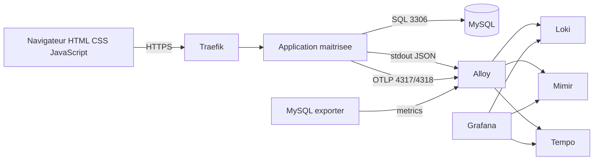

# Integration applicative HTML CSS JavaScript MySQL avec LGTM

## Objectif

Ce document decrit le modele cible pour raccorder une application web maitrisee a la stack LGTM de `Deploy_LGTM`.

Le projet ne fournit plus d'application temoin externe. L'ancienne piste basee sur une application exemple tierce est abandonnee, car elle n'est pas maintenue, n'est pas maitrisee par le projet et ne doit pas etre consideree comme une base securisee.

OpenTelemetry Demo reste une reference documentaire valable pour comprendre les conventions OpenTelemetry, les flux OTLP, la correlation logs/traces/metriques et les patterns d'instrumentation. Elle n'est pas deployee par ce depot.

## Principe retenu

Toute future application de test doit etre:

- developpee ou forkee dans un depot maitrise;
- maintenue explicitement;
- scannee en CI;
- construite avec une image epinglee;
- instrumentee volontairement;
- deployee via GitOps seulement apres revue securite.

## Reference conservee

| Reference | Usage | Statut |
| --- | --- | --- |
| `open-telemetry/opentelemetry-demo` | Reference officielle d'instrumentation, conventions OTLP, traces, metriques et logs. | Conservee comme modele documentaire, non deployee. |

Cette reference sert a guider l'instrumentation d'une future application maitrisee, pas a introduire un workload externe dans `Deploy_LGTM`.

## Architecture cible



## Exigences minimales

| Domaine | Exigence |
| --- | --- |
| Code | Depot maitrise, dependances suivies, pas d'exemple externe non maintenu. |
| Image | Tag explicite, scan vulnerabilites, SBOM. |
| Secrets | `Secret` ou `SealedSecret`, jamais de credentials en `ConfigMap`. |
| Runtime | Non-root, root filesystem read-only si compatible, no privilege escalation. |
| Logs | JSON sur stdout, sans secret ni donnee personnelle. |
| Metriques | Endpoint `/metrics` ou exporter dedie. |
| Traces | OTLP vers Alloy, correlation `trace_id`. |
| Reseau | NetworkPolicies explicites: ingress, DB, OTLP, metrics, DNS. |

## Donnees attendues

### Logs

Les logs applicatifs doivent etre emis en JSON sur `stdout`.

Exemple:

```json
{
  "level": "info",
  "service": "app-demo",
  "environment": "dev",
  "route": "GET /healthz",
  "status": 200,
  "duration_ms": 42,
  "trace_id": "00000000000000000000000000000000"
}
```

Labels Loki recommandes:

- `app`;
- `environment`;
- `namespace`;
- `service`;
- `component`.

Ne jamais mettre en label:

- email;
- identifiant utilisateur brut;
- token;
- cookie;
- payload SQL;
- adresse IP personnelle non anonymisee.

### Metriques

Metriques minimales:

| Metrique | Source |
| --- | --- |
| disponibilite application | endpoint `/metrics` ou probe exportee |
| taux de requetes HTTP | instrumentation applicative |
| latence p95 | instrumentation applicative |
| erreurs 5xx | instrumentation applicative |
| disponibilite MySQL | MySQL exporter |
| connexions MySQL | MySQL exporter |

### Traces

Trace cible:

```text
Browser request
  -> API route
    -> SQL query
      -> MySQL
```

## Flux NetworkPolicy a prevoir

| Flux | Sens | Port |
| --- | --- | --- |
| Traefik vers application | ingress | HTTP applicatif |
| Application vers MySQL | egress | TCP 3306 |
| Application vers Alloy OTLP | egress | TCP 4317/4318 |
| Alloy vers endpoint metrics | egress | TCP endpoint applicatif |
| Alloy vers MySQL exporter | egress | TCP exporter |
| Application vers DNS | egress | TCP/UDP 53 |

## Decision

La prochaine application de validation LGTM devra etre creee comme composant maitrise du projet ou comme depot applicatif controle. Aucun deploiement base sur une application exemple tierce non maintenue ne doit etre ajoute au GitOps `Deploy_LGTM`.

OpenTelemetry Demo reste autorisee comme reference d'architecture et de nomenclature, sans deploiement automatique.
