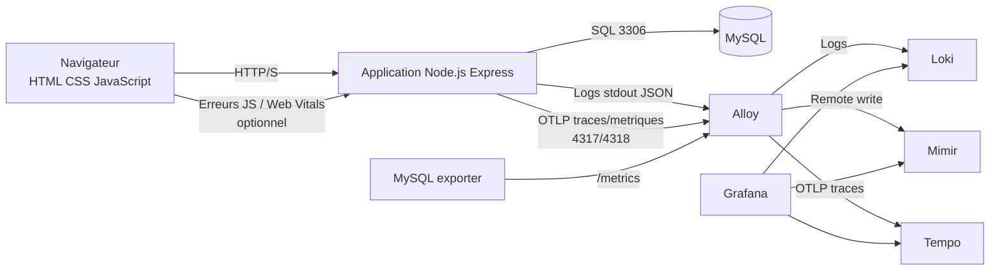

# Integration HTML CSS JavaScript MySQL avec LGTM

## 1. Objectif

Ce document decrit comment integrer une application web classique HTML, CSS, JavaScript et MySQL avec la stack LGTM de `Deploy_LGTM`.

L'objectif n'est pas de transformer `Deploy_LGTM` en depot applicatif. L'objectif est de definir un modele reproductible pour raccorder une application test a:

- Loki pour les logs;
- Mimir pour les metriques;
- Tempo pour les traces;
- Grafana pour les dashboards;
- Alloy comme point de collecte et de routage.

## 2. Applications de reference retenues

Deux applications GitHub servent de reference:

| Reference | Role dans le projet | URL |
| --- | --- | --- |
| `bezkoder/nodejs-express-sequelize-mysql` | Base applicative simple Node.js, Express, Sequelize, MySQL. | https://github.com/bezkoder/nodejs-express-sequelize-mysql |
| `open-telemetry/opentelemetry-demo` | Modele d'instrumentation OpenTelemetry complet. | https://github.com/open-telemetry/opentelemetry-demo |

Decision:

- utiliser `bezkoder/nodejs-express-sequelize-mysql` comme base de test applicatif simple;
- utiliser `open-telemetry/opentelemetry-demo` comme reference pour les conventions OpenTelemetry, OTLP, traces, metriques et logs.

## 3. Architecture cible HLD



## 4. Perimetre applicatif observe

| Couche | Ce qui est observe | Backend LGTM |
| --- | --- | --- |
| Frontend HTML/CSS/JS | erreurs JS, temps de chargement, parcours utilisateur, correlation `trace_id`. | Loki, Tempo, Mimir |
| API Node.js Express | logs HTTP, erreurs, latence, traces de routes, metriques process. | Loki, Tempo, Mimir |
| MySQL | disponibilite, connexions, requetes lentes, erreurs SQL, latence DB. | Loki, Mimir, Tempo |
| Infrastructure Kubernetes | etat pods, redemarrages, ressources, logs stdout. | Loki, Mimir |

## 5. Modele de telemetrie

### Logs

Les logs applicatifs doivent etre emis en JSON sur `stdout`. Alloy les collecte et les route vers Loki.

Exemple:

```json
{
  "timestamp": "2026-07-06T10:15:30Z",
  "level": "info",
  "service": "sample-node-mysql",
  "environment": "dev",
  "route": "GET /api/tutorials",
  "status": 200,
  "duration_ms": 42,
  "trace_id": "4bf92f3577b34da6a3ce929d0e0e4736"
}
```

Labels Loki recommandes:

- `app="sample-node-mysql"`;
- `environment="dev"`;
- `namespace="sample-app"`;
- `service="api"`;
- `component="backend"`;
- `version`.

Ne jamais mettre en label:

- identifiant utilisateur brut;
- email;
- token;
- cookie;
- payload SQL;
- donnee personnelle.

### Metriques

Metriques minimales attendues:

| Metrique | Source | Exemple PromQL |
| --- | --- | --- |
| taux de requetes HTTP | API | `sum(rate(http_server_requests_total[5m])) by (route, status)` |
| latence p95 API | API | `histogram_quantile(0.95, sum(rate(http_server_duration_seconds_bucket[5m])) by (le, route))` |
| erreurs 5xx | API | `sum(rate(http_server_requests_total{status=~"5.."}[5m]))` |
| connexions MySQL | MySQL exporter | `mysql_global_status_threads_connected` |
| disponibilite MySQL | MySQL exporter | `mysql_up` |
| redemarrages pod | kube-state-metrics ou equivalent | `increase(kube_pod_container_status_restarts_total[1h])` |

### Traces

Trace cible:

```text
Browser request
  -> Express route GET /api/tutorials
    -> Sequelize query SELECT tutorials
      -> MySQL
```

Chaque requete doit conserver:

- `trace_id`;
- `span_id`;
- nom de service;
- route HTTP;
- statut HTTP;
- duree;
- attributs DB non sensibles.

## 6. Instrumentation JavaScript frontend

Le frontend peut envoyer:

- erreurs JS;
- temps de chargement;
- Web Vitals;
- evenements utilisateur non sensibles;
- identifiant de session pseudonymise.

Mode simple:

1. Capturer `window.onerror` et `unhandledrejection`.
2. Poster les erreurs vers `/api/client-events`.
3. Le backend journalise ces evenements en JSON.
4. Alloy collecte les logs backend vers Loki.

Mode avance:

1. Ajouter OpenTelemetry JavaScript navigateur.
2. Propager le contexte W3C Trace Context.
3. Exporter vers un endpoint backend ou un collector OTLP controle.

Pour le MVP, le mode simple est recommande.

## 7. Instrumentation backend Node.js

Le backend Node.js doit ajouter:

- logs JSON structures;
- middleware HTTP de mesure de latence;
- endpoint `/metrics` ou export OTLP;
- OpenTelemetry SDK Node.js;
- instrumentation Express;
- instrumentation HTTP;
- instrumentation MySQL/Sequelize si compatible.

Variables d'environnement recommandees:

```text
OTEL_SERVICE_NAME=sample-node-mysql
OTEL_RESOURCE_ATTRIBUTES=deployment.environment=dev,service.version=0.1.0
OTEL_EXPORTER_OTLP_ENDPOINT=http://alloy.observability.svc.cluster.local:4318
OTEL_EXPORTER_OTLP_PROTOCOL=http/protobuf
LOG_LEVEL=info
```

## 8. Instrumentation MySQL

MySQL doit etre observe sans exposer directement la base:

- `mysqld-exporter` pour les metriques Prometheus;
- slow query log si necessaire;
- logs MySQL vers Loki uniquement si le volume est maitrise;
- credentials exporter stockes via Secret ou SealedSecret.

Flux attendu:

```text
Alloy -> mysqld-exporter /metrics
mysqld-exporter -> MySQL 3306
Application -> MySQL 3306
```

## 9. Collecte avec Alloy

Alloy joue trois roles:

| Role | Entree | Sortie |
| --- | --- | --- |
| Collecte logs | stdout pods / fichiers | Loki |
| Collecte metriques | scrape `/metrics`, remote write | Mimir |
| Collecte traces | OTLP 4317/4318 | Tempo |

Le modele cible evite que l'application parle directement a Loki, Mimir ou Tempo. L'application parle a Alloy, ou expose des endpoints que Alloy collecte.

## 10. Flux reseau necessaires

| Source | Destination | Port | Usage |
| --- | --- | --- | --- |
| Navigateur | Ingress application | 443 | Acces application. |
| Application | MySQL | 3306 | Requetes SQL. |
| Application | Alloy | 4317/4318 | Export OTLP si push. |
| Alloy | Application | port `/metrics` | Scrape metriques si pull. |
| Alloy | MySQL exporter | 9104 | Scrape metriques MySQL. |
| MySQL exporter | MySQL | 3306 | Lecture metriques MySQL. |
| Alloy | Loki | 3100/80 | Logs. |
| Alloy | Mimir | 8080/80 | Metriques. |
| Alloy | Tempo | 4317/4318/3100 | Traces. |
| Grafana | Loki/Mimir/Tempo | selon datasource | Visualisation. |

## 11. NetworkPolicies a prevoir

Pour un namespace applicatif `sample-app`:

- autoriser ingress depuis Traefik vers l'application;
- autoriser application vers MySQL;
- autoriser application vers Alloy si export OTLP push;
- autoriser Alloy vers application si scrape `/metrics`;
- autoriser Alloy vers MySQL exporter;
- refuser tout acces direct externe vers MySQL;
- refuser application vers Loki/Mimir/Tempo sauf decision explicite.

## 12. Dashboards Grafana attendus

Dashboards a creer:

| Dashboard | Contenu |
| --- | --- |
| Application Overview | disponibilite, requetes, erreurs, latence p50/p95/p99. |
| Frontend UX | erreurs JS, Web Vitals, pages lentes. |
| API Backend | routes, status codes, erreurs, traces lentes. |
| MySQL | connexions, QPS, slow queries, erreurs, uptime. |
| Correlation | lien logs, metriques et traces via `trace_id`. |

## 13. Alerting minimal

Alertes recommandees:

- application indisponible plus de 5 minutes;
- taux 5xx superieur a 2%;
- p95 API superieur a 500 ms pendant 10 minutes;
- `mysql_up == 0`;
- connexions MySQL proches du maximum;
- erreurs JS en hausse;
- absence de logs applicatifs pendant une fenetre anormale;
- absence de traces OTLP alors que le trafic existe.

## 14. Conventions de labels

Labels communs:

| Label | Exemple | Usage |
| --- | --- | --- |
| `app` | `sample-node-mysql` | Regroupement fonctionnel. |
| `environment` | `dev` | Environnement. |
| `namespace` | `sample-app` | Kubernetes namespace. |
| `service` | `api` | Service logique. |
| `version` | `0.1.0` | Version applicative. |
| `component` | `backend` | Frontend, backend, database, exporter. |
| `team` | `platform` | Ownership. |

## 15. Securite

Regles:

- aucun secret dans les logs;
- pas de token, cookie ou Authorization header dans Loki;
- pas de donnee personnelle brute dans les labels;
- credentials MySQL via Secret ou SealedSecret;
- acces Grafana controle;
- MySQL non expose publiquement;
- NetworkPolicies en allowlist;
- traces avec attributs SQL limites.

## 16. Donnees de test

Les donnees de test sont fournies dans:

- `examples/app-telemetry-test-data.sql`;
- `examples/app-telemetry-test-scenarios.json`;
- `examples/app-telemetry-log-samples.jsonl`.

Elles permettent de simuler:

- utilisateurs;
- produits;
- commandes;
- tutoriels CRUD;
- evenements frontend;
- erreurs API;
- requetes lentes;
- logs applicatifs avec `trace_id`.

## 17. Tests d'integration a effectuer

### Test 1 - Logs applicatifs vers Loki

Action:

1. Generer du trafic HTTP sur l'application.
2. Provoquer une erreur API volontaire.
3. Verifier les logs dans Loki.

Requete LogQL attendue:

```logql
{app="sample-node-mysql", environment="dev"} |= "trace_id"
```

Critere de succes:

- logs JSON visibles;
- `level`, `route`, `status`, `duration_ms`, `trace_id` presents;
- aucune donnee sensible.

### Test 2 - Metriques API vers Mimir

Requete PromQL attendue:

```promql
sum(rate(http_server_requests_total{app="sample-node-mysql"}[5m])) by (route, status)
```

Critere de succes:

- metriques par route visibles;
- erreurs 4xx/5xx distinguables;
- latence p95 exploitable.

### Test 3 - Traces API vers Tempo

Action:

1. Appeler `GET /api/tutorials`.
2. Recuperer le `trace_id` dans les logs.
3. Rechercher ce `trace_id` dans Tempo.

Critere de succes:

- trace visible;
- span HTTP present;
- span DB present ou attribut DB present;
- correlation log -> trace fonctionnelle.

### Test 4 - MySQL exporter vers Mimir

Requetes PromQL attendues:

```promql
mysql_up
mysql_global_status_threads_connected
```

Critere de succes:

- `mysql_up == 1`;
- connexions et QPS visibles;
- alerte possible si MySQL tombe.

## 18. Tests effectues dans ce depot

Tests effectues pendant cette integration documentaire:

| Test | Resultat |
| --- | --- |
| Creation du guide HLD/LLD | OK |
| Creation du rapport d'integration | OK |
| Generation de donnees SQL de test | OK |
| Generation de scenarios HTTP/telemetrie | OK |
| Generation de logs JSONL de test | OK |
| Validation repository `scripts/Test-Repository.ps1` | A executer apres creation |

Tests non effectues a ce stade:

- clone des applications externes;
- build container;
- deploiement Kubernetes;
- envoi reel OTLP vers Alloy;
- validation runtime Grafana/Loki/Mimir/Tempo.

Ces tests relevent d'une iteration applicative separee.

## 19. Criteres d'acceptation

L'integration sera consideree complete quand:

- l'application test est deployee dans un namespace dedie;
- MySQL est non expose publiquement;
- les logs applicatifs arrivent dans Loki;
- les metriques API et MySQL arrivent dans Mimir;
- les traces HTTP/SQL arrivent dans Tempo;
- Grafana contient au moins un dashboard applicatif;
- les NetworkPolicies applicatives sont documentees et testees;
- aucune donnee sensible n'apparait dans les logs.

## 20. Sources

- Application CRUD MySQL: https://github.com/bezkoder/nodejs-express-sequelize-mysql
- OpenTelemetry Demo: https://github.com/open-telemetry/opentelemetry-demo
- OpenTelemetry Demo documentation: https://opentelemetry.io/docs/demo/
