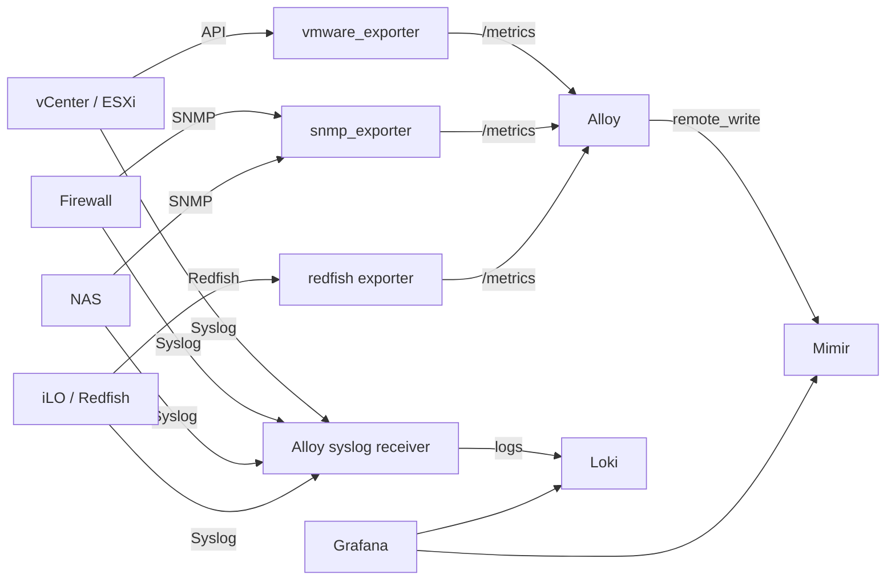

# Integration supervision infra avec LGTM

## Objectif

Ce document decrit le modele d'integration d'equipements d'infrastructure externes avec la stack LGTM de `Deploy_LGTM`.

La version Git ne contient aucune adresse reelle, aucun nom sensible et aucun credential. Les cibles reelles doivent rester dans un fichier local ignore par Git.

## Fichiers

| Fichier | Versionne | Role |
| --- | --- | --- |
| `docs/integrations/02-infra-monitoring-lgtm.md` | Oui | Guide HLD/LLD generique. |
| `examples/infra-targets.example.yaml` | Oui | Exemple anonymise de cibles. |
| `local/infra-targets.local.yaml` | Non | Inventaire reel local, ignore par Git. |

## Inventaire local attendu

Creer le fichier local suivant:

```text
local/infra-targets.local.yaml
```

Schema attendu:

```yaml
targets:
  - name: vcenter
    ip: 192.0.2.10
    type: vmware
    metrics: api
    logs: syslog

  - name: firewall
    ip: 192.0.2.20
    type: firewall
    metrics: snmp
    logs: syslog

  - name: nas
    ip: 192.0.2.30
    type: nas
    metrics: snmp
    logs: syslog

  - name: ilo-node-01
    ip: 192.0.2.40
    type: ilo
    metrics: redfish
    logs: syslog
```

## Architecture HLD



## Flux LLD

| Source | Destination | Protocole | Backend |
| --- | --- | --- | --- |
| Exporter VMware | vCenter / ESXi | HTTPS API | Mimir |
| Exporter SNMP | firewall / NAS | SNMP | Mimir |
| Exporter Redfish | iLO | HTTPS Redfish | Mimir |
| Equipements infra | Alloy syslog | Syslog UDP/TCP | Loki |
| Grafana | Mimir | HTTP interne | Dashboards metriques |
| Grafana | Loki | HTTP interne | Dashboards logs |

## Collecte recommandee

| Type | Metriques | Logs |
| --- | --- | --- |
| `vmware` | `vmware_exporter` | Syslog vCenter/ESXi |
| `firewall` | `snmp_exporter` | Syslog firewall |
| `nas` | `snmp_exporter` ou exporter dedie | Syslog NAS |
| `ilo` | Redfish exporter | Syslog iLO |

## Credentials

Aucun credential ne doit etre stocke dans Git.

Les secrets reels doivent etre:

1. stockes hors Git;
2. injectes dans Kubernetes sous forme de `Secret`;
3. chiffres avec Sealed Secrets avant toute version Git;
4. limites a des comptes lecture seule.

Recommandations:

- preferer SNMPv3 a SNMPv2c;
- utiliser des comptes vCenter/iLO lecture seule;
- dedier un secret par cible ou famille de cibles;
- isoler les exporters avec des `NetworkPolicy`.

## Dashboards attendus

Arborescence Grafana proposee:

```text
Deploy_LGTM
  Infra
    VMware Overview
    Firewall Overview
    NAS Overview
    iLO Hardware
```

Panels prioritaires:

| Dashboard | Panels |
| --- | --- |
| VMware Overview | hosts, VM, datastores, CPU ready, memoire, evenements critiques |
| Firewall Overview | interfaces, gateways, drops, VPN, CPU/RAM, logs blocks |
| NAS Overview | volumes, storage pool, SMART, temperature, reseau |
| iLO Hardware | health global, fans, PSU, temperature, disques |

## Alertes minimales

| Categorie | Alerte |
| --- | --- |
| VMware | host deconnecte |
| VMware | datastore libre sous seuil |
| Firewall | gateway down |
| Firewall | perte de paquets elevee |
| NAS | volume degrade |
| NAS | disque SMART critique |
| iLO | etat hardware critique |
| Tous | absence de metriques depuis plus de 10 minutes |
| Tous | absence de logs depuis plus de 10 minutes |

## Plan d'integration

1. Completer `local/infra-targets.local.yaml`.
2. Valider les flux reseau depuis Kubernetes vers les equipements.
3. Activer SNMP ou API lecture seule selon les cibles.
4. Activer l'envoi syslog vers le point de collecte.
5. Creer les secrets hors Git.
6. Generer les `SealedSecret`.
7. Deployer les exporters.
8. Ajouter les scrapes Alloy.
9. Ajouter les dashboards Grafana.
10. Ajouter les alertes minimales.
