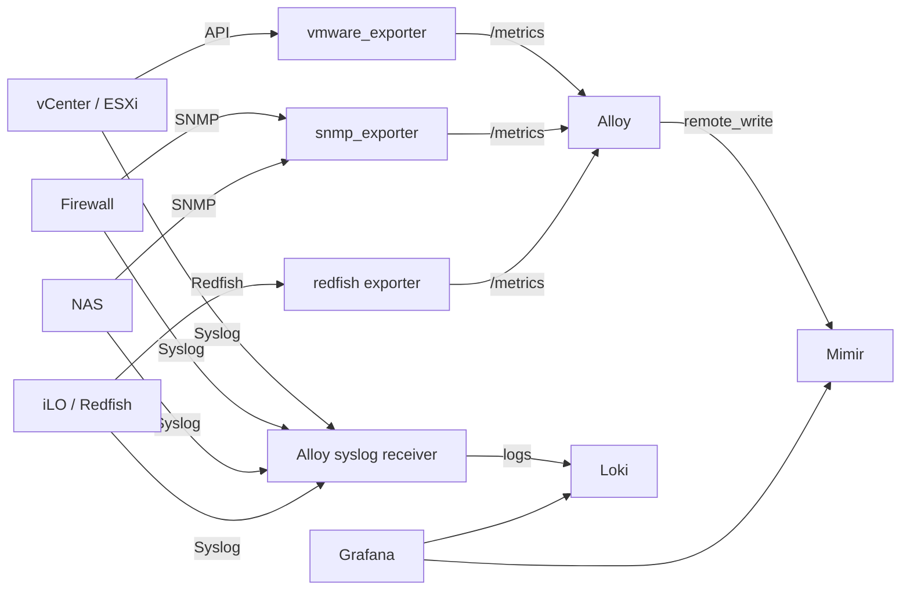

# Integration supervision infra avec LGTM

## Objectif

Ce document decrit le modele d'integration d'equipements d'infrastructure externes avec la stack LGTM de `Deploy_LGTM`.

La version Git ne contient aucune adresse reelle, aucun nom sensible et aucun credential. Les cibles reelles doivent rester dans un fichier local ignore par Git.

## Fichiers

| Fichier | Versionne | Role |
| --- | --- | --- |
| `docs/integrations/02-infra-monitoring-lgtm.md` | Oui | Guide HLD/LLD generique. |
| `examples/infra-targets.example.yaml` | Oui | Exemple anonymise de cibles. |
| `local/infra-targets.local.yaml` | Non | Inventaire reel local, ignore par Git. |
| `local/pfsense-snmp.yml` | Non | Config locale `snmp_exporter` contenant la community SNMP. |

## Inventaire local attendu

Creer le fichier local suivant:

```text
local/infra-targets.local.yaml
```

Schema attendu:

```yaml
targets:
  - name: vcenter
    ip: 192.0.2.10
    type: vmware
    metrics: api
    logs: syslog

  - name: firewall
    ip: 192.0.2.20
    type: firewall
    metrics: snmp
    logs: syslog

  - name: nas
    ip: 192.0.2.30
    type: nas
    metrics: snmp
    logs: syslog

  - name: ilo-node-01
    ip: 192.0.2.40
    type: ilo
    metrics: redfish
    logs: syslog
```

## Architecture HLD



## Flux LLD

| Source | Destination | Protocole | Backend |
| --- | --- | --- | --- |
| Exporter VMware | vCenter / ESXi | HTTPS API | Mimir |
| Exporter SNMP | firewall / NAS | SNMP | Mimir |
| Exporter Redfish | iLO | HTTPS Redfish | Mimir |
| Equipements infra | Alloy syslog | Syslog UDP/TCP | Loki |
| Grafana | Mimir | HTTP interne | Dashboards metriques |
| Grafana | Loki | HTTP interne | Dashboards logs |

## Collecte recommandee

| Type | Metriques | Logs |
| --- | --- | --- |
| `vmware` | `vmware_exporter` | Syslog vCenter/ESXi |
| `firewall` | `snmp_exporter` | Syslog firewall |
| `nas` | `snmp_exporter` ou exporter dedie | Syslog NAS |
| `ilo` | Redfish exporter | Syslog iLO |

## Integration pfSense SNMP

La collecte pfSense utilise:

```text
pfSense UDP/161
  <- snmp-exporter
  <- Alloy /snmp scrape
  -> Mimir
  -> Grafana
```

Objets versionnes:

| Objet | Role |
| --- | --- |
| `infra-monitoring` | Application Argo CD dediee aux exporters infra. |
| `snmp-exporter` | Deployment et Service internes dans `observability`. |
| `prometheus.scrape.pfsense_snmp_*` | Scrapes Alloy vers `snmp-exporter`. |
| `allow-alloy-to-snmp-exporter` | Autorise l'entree Alloy vers `snmp-exporter`. |
| `allow-alloy-egress-to-snmp-exporter` | Autorise la sortie Alloy vers `snmp-exporter`. |
| `allow-snmp-exporter-to-private-snmp-targets` | Autorise la sortie UDP/161 vers les cibles SNMP privees. |

Objets locaux hors Git:

| Objet | Role |
| --- | --- |
| `observability/snmp-exporter-config` | Secret Kubernetes contenant `snmp.yml` et la community SNMP. |
| `observability/pfsense-snmp-target` | Service headless + Endpoints pointant vers pfSense. |
| `observability/synology-snmp-target` | Service headless + Endpoints pointant vers le NAS DSM. |

Modules SNMP actives:

| Module | Usage |
| --- | --- |
| `if_mib` | Interfaces, trafic, etats, erreurs. |
| `hrSystem` | Uptime systeme. |
| `hrStorage` | Volumes et filesystems. |
| `ucd_memory` | Memoire. |
| `ucd_system_stats` | Compteurs CPU systeme. |
| `synology` | Etat DSM, disques, temperatures, ventilateurs, volumes Synology. |

Metriques validees:

```promql
up{app="pfsense"}
ifHCInOctets{app="pfsense"}
hrSystemUptime{app="pfsense"}
memTotalReal{app="pfsense"}
ssCpuRawUser{app="pfsense"}
```

## Integration Synology DSM SNMP

La collecte DSM utilise le meme `snmp-exporter` et le meme secret local que pfSense, mais avec une cible separee:

```text
Synology DSM UDP/161
  <- snmp-exporter
  <- Alloy /snmp scrape
  -> Mimir
  -> Grafana
```

Nom fonctionnel utilise dans les labels:

```text
synology.example.local
```

Scrapes Alloy:

| Scrape | Module | Usage |
| --- | --- | --- |
| `synology_snmp_nas` | `synology` | Disques, temperatures, sante DSM/Synology. |
| `synology_snmp_interfaces` | `if_mib` | Trafic reseau. |
| `synology_snmp_system` | `hrSystem` | Uptime. |
| `synology_snmp_storage` | `hrStorage` | Volumes et filesystems. |

Metriques validees:

```promql
up{app="synology"}
diskHealthStatus{app="synology"}
diskTemperature{app="synology"}
diskBadSector{app="synology"}
ifHCInOctets{app="synology"}
hrSystemUptime{app="synology"}
hrStorageSize{app="synology"}
```

## Credentials

Aucun credential ne doit etre stocke dans Git.

Les secrets reels doivent etre:

1. stockes hors Git;
2. injectes dans Kubernetes sous forme de `Secret`;
3. chiffres avec Sealed Secrets avant toute version Git;
4. limites a des comptes lecture seule.

Recommandations:

- preferer SNMPv3 a SNMPv2c;
- utiliser des comptes vCenter/iLO lecture seule;
- dedier un secret par cible ou famille de cibles;
- isoler les exporters avec des `NetworkPolicy`.

## Dashboards attendus

Arborescence Grafana proposee:

```text
Deploy_LGTM
  Deploy_LGTM vCenter Logs Overview
  Deploy_LGTM pfSense Overview
  Deploy_LGTM Synology DSM Overview
  Infra
    VMware Metrics Overview
    Firewall Overview
    NAS Overview
    iLO Hardware
```

### Dashboard vCenter Logs Overview

Le dashboard `Deploy_LGTM vCenter Logs Overview` est provisionne dans Grafana depuis Git.

Objectif:

- valider rapidement que les logs vCenter arrivent dans Loki;
- suivre le volume d'evenements vCenter;
- isoler les erreurs, warnings et evenements critiques;
- donner une premiere vue exploitable avant l'ajout d'un exporter vSphere.

Datasource:

```text
Loki
```

Requete de base:

```logql
{job="infra-syslog"} |~ "(?i)(vcenter|vsphere|vmware|vpxd|hostd|vpxa|eam|sps|cis-license)"
```

Panels provisionnes:

| Panel | Role |
| --- | --- |
| `vCenter Events` | Nombre total d'evenements vCenter sur la periode. |
| `Critical/Error Events` | Volume d'evenements critiques ou erreurs. |
| `vCenter Log Rate` | Debit de logs vCenter par protocole d'ingestion. |
| `Warning/Error Distribution` | Evolution des warnings et erreurs detectes. |
| `Recent vCenter Logs` | Vue brute des derniers logs vCenter. |
| `Recent vCenter Warnings and Errors` | Vue filtree sur les messages a traiter en priorite. |

Limite volontaire:

- le dashboard exploite les logs syslog bruts collectes par Alloy;
- aucune adresse reelle, hostname sensible ou credential n'est encode dans Git;
- les metriques vSphere detaillees, par exemple hosts, VM, datastores, CPU ready et memoire, necessitent un exporter API vSphere dedie.

Panels prioritaires:

| Dashboard | Panels |
| --- | --- |
| vCenter Logs Overview | volume logs, erreurs, warnings, evenements recents |
| pfSense Overview | statut SNMP, uptime, memoire, CPU, trafic interfaces, filesystems, logs |
| Synology DSM Overview | statut SNMP, uptime, volumes, trafic, temperatures, sante disques, logs |
| VMware Metrics Overview | hosts, VM, datastores, CPU ready, memoire, evenements critiques |
| Firewall Overview | interfaces, gateways, drops, VPN, CPU/RAM, logs blocks |
| NAS Overview | volumes, storage pool, SMART, temperature, reseau |
| iLO Hardware | health global, fans, PSU, temperature, disques |

## Alertes minimales

| Categorie | Alerte |
| --- | --- |
| VMware | host deconnecte |
| VMware | datastore libre sous seuil |
| Firewall | gateway down |
| Firewall | perte de paquets elevee |
| NAS | volume degrade |
| NAS | disque SMART critique |
| iLO | etat hardware critique |
| Tous | absence de metriques depuis plus de 10 minutes |
| Tous | absence de logs depuis plus de 10 minutes |

## Plan d'integration

1. Completer `local/infra-targets.local.yaml`.
2. Valider les flux reseau depuis Kubernetes vers les equipements.
3. Activer SNMP ou API lecture seule selon les cibles.
4. Activer l'envoi syslog vers le point de collecte.
5. Creer les secrets hors Git.
6. Generer les `SealedSecret`.
7. Deployer les exporters.
8. Ajouter les scrapes Alloy.
9. Ajouter les dashboards Grafana.
10. Ajouter les alertes minimales.
