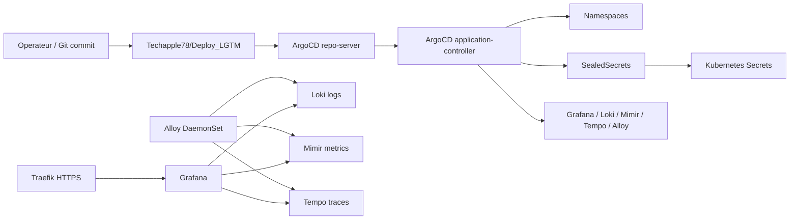
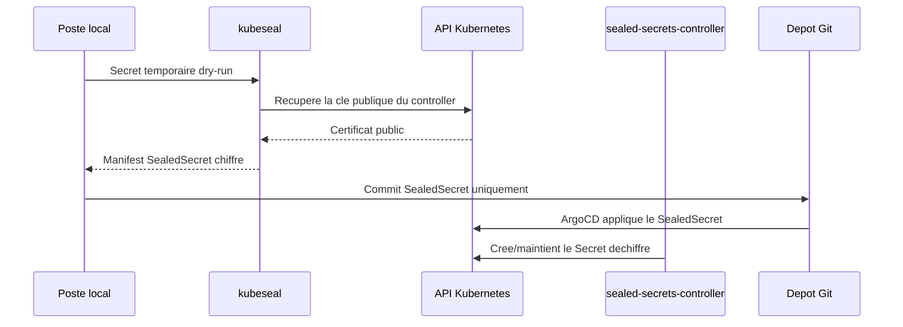

# Inventaire des pods lies au projet

Date: 2026-07-03

## Lecture du perimetre

Le projet `Deploy_LGTM` n'a pas encore deploye la stack LGTM complete. A la fin de l'iteration 3, la seule modification appliquee au cluster par ce projet est l'installation du controller Sealed Secrets.

Pods directement lies au projet:

- `argocd/*`: moteur GitOps deja present, qui servira a synchroniser ce depot.
- `kube-system/sealed-secrets-controller-*`: installe pendant l'iteration 3 pour chiffrer/dechiffrer les secrets GitOps.
- `kube-system/traefik-*` et `kube-system/svclb-traefik-*`: ingress K3S qui exposera Grafana.
- `kube-system/local-path-provisioner-*`: stockage dynamique K3S utilise par defaut si aucune StorageClass vSphere n'est choisie.
- `kube-system/metrics-server-*` et `kube-system/coredns-*`: services cluster necessaires au fonctionnement de base.

Pods de contexte utiles mais hors stack LGTM:

- `crewai/*`: application source dont les secrets et variables ont ete importes localement.
- `nvidia-device-plugin/*`: composant GPU utile au cluster et a CrewAI, pas a LGTM dans le MVP.
- `dockerelk/*` et `elastic-system/*`: stack ELK existante, hors perimetre LGTM mais interessante pour comparaison/migration.

## Capture avant deploiement LGTM

La capture fournie montre le cluster avant deploiement de la stack LGTM. Elle contient deja `sealed-secrets-controller` avec un age court, donc elle correspond au moment juste apres installation du controller Sealed Secrets, mais avant synchronisation LGTM.

| Namespace | Pod | Role | Etat capture |
| --- | --- | --- | --- |
| `argocd` | `argocd-application-controller-0` | Controle les `Application` ArgoCD et reconcilie l'etat Git vers Kubernetes. | Running |
| `argocd` | `argocd-applicationset-controller-*` | Genere des applications ArgoCD depuis des templates ApplicationSet. | Running |
| `argocd` | `argocd-dex-server-*` | Fournit le composant OIDC/Dex pour l'authentification ArgoCD. | Running |
| `argocd` | `argocd-notifications-controller-*` | Gere les notifications ArgoCD. | Running |
| `argocd` | `argocd-redis-*` | Cache/session interne ArgoCD. | Running |
| `argocd` | `argocd-repo-server-*` | Clone les depots Git et rend Helm/Kustomize/manifests. | Running |
| `argocd` | `argocd-server-*` | API et interface web ArgoCD. | Running |
| `crewai` | `crewai-api-*` | API applicative CrewAI, source de contexte pour les secrets importes. | Running |
| `crewai` | `crewai-ui-*` | Interface utilisateur CrewAI. | Running |
| `crewai` | `ollama-*` | Runtime modele/LLM utilise par CrewAI. | Running |
| `crewai` | `ollama-model-pull-*` | Job de recuperation de modele. | Completed |
| `dockerelk` | `dockerelk-es-default-0` | Elasticsearch existant. | Running |
| `dockerelk` | `dockerelk-kb-*` | Kibana existant. | Running |
| `dockerelk` | `dockerelk-ls-0` | Logstash existant; redemarrages frequents observes. | Running, instable |
| `elastic-system` | `elastic-operator-0` | Operateur ECK gerant la stack Elastic. | Running |
| `kube-system` | `coredns-*` | DNS interne Kubernetes. | Running |
| `kube-system` | `helm-install-traefik-*` | Job K3S d'installation Traefik. | Completed |
| `kube-system` | `helm-install-traefik-crd-*` | Job K3S d'installation des CRD Traefik. | Completed |
| `kube-system` | `local-path-provisioner-*` | Provisioner de volumes local-path. | Running |
| `kube-system` | `metrics-server-*` | API metriques Kubernetes. | Running |
| `kube-system` | `sealed-secrets-controller-*` | Controller Sealed Secrets installe pour le projet. | Running |
| `kube-system` | `svclb-traefik-*` | Load balancer K3S ServiceLB pour Traefik sur les noeuds. | Running |
| `kube-system` | `traefik-*` | Ingress controller HTTP/HTTPS. | Running |
| `nvidia-device-plugin` | `nvidia-device-plugin-*` | Expose le GPU NVIDIA au scheduler Kubernetes. | Running |

## Etat apres iteration 3

Commande executee:

```powershell
kubectl get pods -A -o wide
```

| Namespace | Pod courant | Noeud | Role pour le projet | Etat |
| --- | --- | --- | --- | --- |
| `argocd` | `argocd-application-controller-0` | `k3s-agent-2` | Reconciliation GitOps. | Running |
| `argocd` | `argocd-applicationset-controller-68fd97ccb6-wcqbq` | `k3s-agent-2` | ApplicationSet ArgoCD. | Running |
| `argocd` | `argocd-dex-server-99ff57675-9dsdg` | `k3s-agent-1` | Auth OIDC ArgoCD. | Running |
| `argocd` | `argocd-notifications-controller-8596549fb6-fljqh` | `k3s-agent-1` | Notifications ArgoCD. | Running |
| `argocd` | `argocd-redis-6f6867546c-bxzgw` | `k3s-agent-2` | Cache ArgoCD. | Running |
| `argocd` | `argocd-repo-server-59444f4bbb-qwgnv` | `k3s-agent-1` | Rendu Git/Helm/Kustomize. | Running |
| `argocd` | `argocd-server-765575f778-mpmdw` | `k3s-server-1` | API/UI ArgoCD. | Running |
| `kube-system` | `sealed-secrets-controller-648c8bdf44-vdtf4` | `k3s-server-1` | Dechiffre les `SealedSecret` du depot en `Secret` Kubernetes. | Running |
| `kube-system` | `traefik-ffdbb68d6-czglv` | `k3s-agent-2` | Exposition future de Grafana. | Running |
| `kube-system` | `svclb-traefik-*` | `k3s-server-1`, `k3s-agent-1`, `k3s-agent-2` | Load balancer K3S pour Traefik. | Running |
| `kube-system` | `local-path-provisioner-58d557dc48-zdv94` | `k3s-server-1` | Provisionnement PVC par defaut. | Running |
| `kube-system` | `metrics-server-7c86f97b8d-6dft8` | `k3s-server-1` | Metriques Kubernetes de base. | Running |
| `kube-system` | `coredns-6648f7576f-cbw4t` | `k3s-server-1` | Resolution DNS interne. | Running |
| `crewai` | `crewai-api-*`, `crewai-ui-*`, `ollama-*` | Mixte | Source de secrets/variables importes; hors deploiement LGTM. | Running |
| `dockerelk` | `dockerelk-es-*`, `dockerelk-kb-*`, `dockerelk-ls-*` | Mixte | Stack observabilite existante; hors MVP LGTM. | ES/KB Running, LS instable |
| `elastic-system` | `elastic-operator-0` | `k3s-agent-1` | Operateur Elastic existant. | Running |
| `nvidia-device-plugin` | `nvidia-device-plugin-pchch` | `srv-ai-crew01` | Exposition GPU; hors MVP LGTM. | Running |

## Applications ArgoCD existantes

| Application | Sync | Health | Lien avec le projet |
| --- | --- | --- | --- |
| `deploy-crewai` | Synced | Healthy | Source de contexte et de secrets importes. |
| `dockerelk-v2` | OutOfSync | Degraded | Stack existante a surveiller; possible migration/comparaison vers LGTM. |
| `nvidia-device-plugin` | Synced | Healthy | Support GPU pour le cluster et CrewAI. |

`Deploy_LGTM` n'est pas encore synchronise par ArgoCD car le depot GitHub cible n'a pas encore ete cree/pousse.

## Fonctionnement cible apres deploiement LGTM



## Flux Sealed Secrets



## Points d'attention

- `dockerelk-ls-0` presente de nombreux redemarrages; a surveiller independamment de LGTM.
- `Deploy_LGTM` ne doit pas reutiliser de secrets CrewAI en clair; seuls les SealedSecrets sont versionnes.
- La cle privee Sealed Secrets du cluster doit etre sauvegardee hors Git.
- Le prochain deploiement reel sera la synchronisation ArgoCD de `Deploy_LGTM`.

