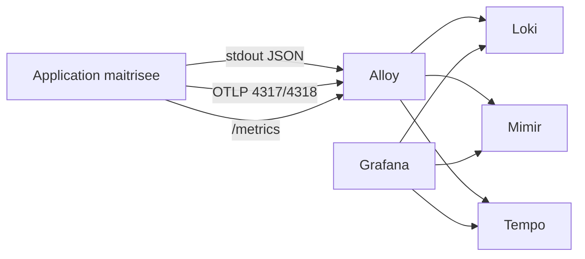

# Rapport - Integration applicative LGTM avec reference OpenTelemetry

Date: 2026-07-07

## Objectif

Conserver un plan d'integration applicative pour faire consommer de la telemetrie a la stack LGTM, sans dependance a une application exemple non maintenue.

Le projet ne retient plus l'ancienne base applicative tierce. En revanche, `open-telemetry/opentelemetry-demo` reste une reference utile pour:

- les conventions OpenTelemetry;
- l'export OTLP;
- la correlation logs, metriques et traces;
- les patterns de propagation de contexte;
- la construction de dashboards applicatifs.

## Decision

| Sujet | Decision |
| --- | --- |
| Application exemple non maintenue | Retiree du perimetre. |
| OpenTelemetry Demo | Conservee comme reference documentaire. |
| Deploiement runtime | Aucun deploiement applicatif externe dans cette phase. |
| Future app test | A creer ou forker dans un depot maitrise. |

## Architecture cible

## Tests d'integration a reprendre

| Test | Systeme cible | Objectif |
| --- | --- | --- |
| Logs applicatifs | Loki | Verifier logs JSON, niveaux, `trace_id`, absence de secret. |
| Metriques API | Mimir | Verifier debit, erreurs, latence et disponibilite. |
| Traces applicatives | Tempo | Verifier propagation de contexte et spans metier. |
| Dashboard | Grafana | Afficher une vue applicative coherente. |
| NetworkPolicies | Kubernetes | Autoriser uniquement les flux necessaires vers Alloy et la base. |

## Exigences pour la future application

- code maitrise par le projet;
- image epinglee et scannee;
- SBOM disponible;
- secrets via `Secret` ou `SealedSecret`;
- pas de credentials dans `ConfigMap`;
- securityContext compatible PSA `restricted` autant que possible;
- instrumentation inspiree des conventions OpenTelemetry Demo.

## Sources

- OpenTelemetry Demo: https://github.com/open-telemetry/opentelemetry-demo
- OpenTelemetry Demo documentation: https://opentelemetry.io/docs/demo/
