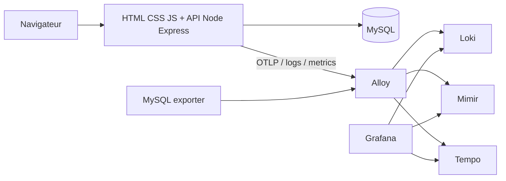

# Rapport - Integration application test LGTM

Date: 2026-07-06

## Objectif

Preparer l'integration d'une application test HTML, CSS, JavaScript et MySQL avec la stack LGTM de `Deploy_LGTM`.

L'objectif est de disposer d'un scenario applicatif concret pour consommer la telemetrie de la plateforme:

- logs dans Loki;
- metriques dans Mimir;
- traces dans Tempo;
- dashboards dans Grafana;
- collecte via Alloy.

## Applications retenues

| Application | Usage | Decision |
| --- | --- | --- |
| `bezkoder/nodejs-express-sequelize-mysql` | Base applicative simple Node.js, Express, Sequelize, MySQL. | Retenue comme app test principale. |
| `open-telemetry/opentelemetry-demo` | Reference officielle d'instrumentation OpenTelemetry. | Retenue comme modele d'instrumentation. |

## Rendu attendu

Le rendu cible est une application test capable de demontrer la chaine suivante:

## Livrables crees

| Fichier | Role |
| --- | --- |
| `docs/integrations/01-html-css-js-mysql-lgtm.md` | Guide HLD/LLD d'integration applicative. |
| `examples/app-telemetry-test-data.sql` | Donnees SQL de test pour MySQL. |
| `examples/app-telemetry-test-scenarios.json` | Scenarios de trafic et resultats attendus. |
| `examples/app-telemetry-log-samples.jsonl` | Exemples de logs JSONL attendus dans Loki. |

## Donnees de test generees

Les donnees de test couvrent:

- utilisateurs fictifs;
- produits;
- commandes;
- tutoriels CRUD compatibles avec la base Bezkoder;
- evenements frontend;
- erreurs API;
- traces correlees avec `trace_id`.

Elles permettent de valider:

- la correlation logs/traces;
- les erreurs HTTP;
- la latence;
- les evenements frontend;
- l'activite SQL.

## Tests d'integration documentes

| Test | Systeme cible | Requete de validation | Statut |
| --- | --- | --- | --- |
| Logs applicatifs | Loki | `{app="sample-node-mysql", environment="dev"} |= "trace_id"` | Planifie |
| Metriques API | Mimir | `sum(rate(http_server_requests_total{app="sample-node-mysql"}[5m])) by (route, status)` | Planifie |
| Traces API/SQL | Tempo | Recherche par `trace_id` depuis un log Loki | Planifie |
| Metriques MySQL | Mimir | `mysql_up`, `mysql_global_status_threads_connected` | Planifie |
| Dashboard | Grafana | Dashboard application overview | Planifie |

## Tests effectues dans le depot

| Test | Resultat |
| --- | --- |
| Coherence documentaire HLD/LLD | OK |
| Generation des donnees SQL | OK |
| Generation des scenarios JSON | OK |
| Generation des logs JSONL | OK |
| Validation repository | A executer apres creation |

## Tests non effectues

Les actions suivantes ne sont pas encore realisees:

- clonage des depots externes;
- build d'image applicative;
- deploiement Kubernetes;
- instrumentation runtime Node.js;
- branchement OTLP reel vers Alloy;
- validation dans Grafana/Loki/Mimir/Tempo.

Ces actions doivent etre planifiees dans une iteration applicative separee.

## NetworkPolicies a prevoir

Pour une future integration runtime, prevoir:

- Traefik vers application;
- application vers MySQL;
- application vers Alloy OTLP;
- Alloy vers application `/metrics`;
- Alloy vers MySQL exporter;
- interdiction d'exposition directe MySQL;
- interdiction d'acces direct de l'application a Loki/Mimir/Tempo.

## Risques

| Risque | Impact | Mitigation |
| --- | --- | --- |
| Logs contenant des secrets | Fuite dans Loki | Masquage et revue des logs avant ingestion. |
| Trop de labels dynamiques | Cardinalite Loki/Mimir elevee | Labels standards uniquement. |
| MySQL expose | Risque securite | Service interne + NetworkPolicy. |
| Traces trop verbeuses | Cout stockage Tempo | Sampling et attributs limites. |
| Application exemple non maintenue | Dette technique | Fork interne ou app minimale dediee si necessaire. |

## Decision

La meilleure strategie est:

1. partir de `bezkoder/nodejs-express-sequelize-mysql`;
2. ajouter une instrumentation inspiree de `open-telemetry/opentelemetry-demo`;
3. router toute la telemetrie vers Alloy;
4. visualiser et alerter depuis Grafana;
5. garder l'application test hors du scope coeur `Deploy_LGTM` tant qu'elle n'est pas stabilisee.
