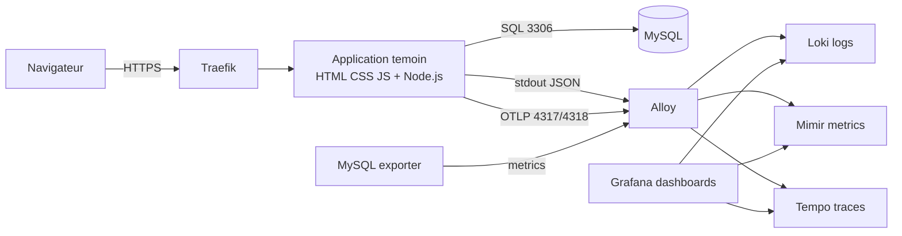

# Rapport Phase 5 - Deploiement application temoin LGTM

Date: 2026-07-06

## Objectif

Planifier l'iteration de deploiement d'une application temoin HTML, CSS, JavaScript et MySQL afin de stabiliser la stack LGTM avec une charge applicative reelle.

Cette iteration sert de pont entre:

- la Phase 4, qui a valide la premiere synchronisation GitOps LGTM;
- la Phase 5, qui doit stabiliser Loki, Mimir, Tempo, Alloy et Grafana avec des donnees exploitables.

## Principe

Pour stabiliser LGTM, il faut lui faire consommer de la telemetrie representative:

- logs applicatifs;
- metriques HTTP;
- metriques MySQL;
- traces API vers base de donnees;
- evenements frontend JavaScript;
- erreurs controlees;
- trafic nominal et trafic degrade.

L'application temoin devient donc le banc d'essai de la plateforme.

## References applicatives

| Reference | Role |
| --- | --- |
| `bezkoder/nodejs-express-sequelize-mysql` | Base applicative CRUD Node.js / Express / Sequelize / MySQL. |
| `open-telemetry/opentelemetry-demo` | Reference pour le modele OpenTelemetry et les conventions OTLP. |

## Architecture HLD de l'iteration



## Decoupage de l'iteration

### Lot 1 - Cadrage applicatif

Objectif:

- figer le namespace cible, par exemple `sample-app`;
- choisir le mode d'integration: fork applicatif ou manifests locaux de test;
- confirmer le nom DNS de l'application;
- confirmer le mode TLS via Traefik.

Livrables:

- decision d'architecture;
- schema de flux;
- conventions de labels;
- liste des secrets MySQL requis.

### Lot 2 - Packaging et donnees de test

Objectif:

- preparer l'application temoin;
- injecter les donnees SQL de test;
- exposer une route healthcheck;
- exposer des routes generant trafic nominal et erreurs controlees.

Donnees disponibles:

- `examples/app-telemetry-test-data.sql`;
- `examples/app-telemetry-test-scenarios.json`;
- `examples/app-telemetry-log-samples.jsonl`.

Critere de sortie:

- application construisible;
- MySQL initialise;
- scenarios HTTP de base reproductibles.

### Lot 3 - Instrumentation telemetrie

Objectif:

- ajouter logs JSON structures;
- ajouter OpenTelemetry Node.js;
- ajouter propagation `trace_id`;
- ajouter metriques HTTP;
- ajouter MySQL exporter;
- router vers Alloy.

Flux attendus:

| Source | Destination | Donnees |
| --- | --- | --- |
| App stdout | Alloy | Logs JSON |
| App OTLP | Alloy | Traces et metriques |
| MySQL exporter | Alloy | Metriques MySQL |
| Alloy | Loki | Logs |
| Alloy | Mimir | Metriques |
| Alloy | Tempo | Traces |

Critere de sortie:

- un appel API produit un log, une metrique et une trace correles.

### Lot 4 - Deploiement GitOps

Objectif:

- creer les manifests ou chart applicatif;
- ajouter une application ArgoCD dediee si retenu;
- deployer application, MySQL et exporter;
- ajouter ingress Traefik;
- ajouter NetworkPolicies.

Ressources attendues:

| Ressource | Role |
| --- | --- |
| Namespace `sample-app` | Isolation applicative. |
| Deployment application | API et frontend. |
| StatefulSet ou Deployment MySQL | Base de test. |
| Deployment MySQL exporter | Metriques DB. |
| Service application | Acces interne. |
| Service MySQL | Acces DB interne. |
| Ingress application | Acces via Traefik. |
| Secret/SealedSecret MySQL | Credentials. |
| NetworkPolicies | Allowlist applicative. |

Critere de sortie:

- application accessible via Traefik;
- MySQL non expose publiquement;
- ArgoCD `Synced/Healthy`.

### Lot 5 - Dashboard et alerting Grafana

Objectif:

- creer un dashboard applicatif minimal;
- ajouter les panels logs/metriques/traces;
- creer les alertes de base.

Panels attendus:

- disponibilite application;
- requetes par route/status;
- taux erreurs 4xx/5xx;
- latence p50/p95/p99;
- logs erreurs recents;
- traces lentes;
- `mysql_up`;
- connexions MySQL;
- evenements frontend.

Alertes minimales:

- application down;
- `mysql_up == 0`;
- taux 5xx eleve;
- p95 eleve;
- absence de traces;
- absence de logs applicatifs.

### Lot 6 - Stabilisation LGTM

Objectif:

- observer la stack sous charge pendant 24h;
- relever CPU/RAM/PVC/restarts;
- ajuster ressources;
- completer les NetworkPolicies;
- documenter les warnings Kyverno/PSA;
- valider la retention initiale.

Indicateurs a suivre:

| Composant | Points de controle |
| --- | --- |
| Loki | ingestion logs, erreurs, PVC, canary, requetes LogQL. |
| Mimir | ingestion remote write, cardinalite, latence query. |
| Tempo | traces recues, recherche par trace ID, latence. |
| Alloy | targets actifs, erreurs d'export, backpressure. |
| Grafana | datasources, dashboards, alertes. |

## Tests d'integration runtime

### Test A - Acces application

Action:

```text
Navigateur -> https://sample-app.<domaine>
```

Succes:

- page chargee;
- API health OK;
- aucun acces direct MySQL depuis l'exterieur.

### Test B - Logs Loki

Requete:

```logql
{app="sample-node-mysql", environment="dev"} |= "trace_id"
```

Succes:

- logs JSON presents;
- erreurs controlees visibles;
- aucun secret dans les logs.

### Test C - Metriques Mimir

Requetes:

```promql
sum(rate(http_server_requests_total{app="sample-node-mysql"}[5m])) by (route, status)
mysql_up
```

Succes:

- trafic visible;
- MySQL visible;
- erreurs 5xx mesurables.

### Test D - Traces Tempo

Action:

1. Appeler `GET /api/tutorials`.
2. Recuperer le `trace_id` depuis Loki.
3. Chercher le `trace_id` dans Tempo.

Succes:

- trace trouvee;
- span HTTP present;
- span SQL ou attribut DB present;
- correlation log vers trace fonctionnelle.

### Test E - Dashboard Grafana

Succes:

- dashboard charge;
- panels non vides;
- logs, metriques et traces accessibles depuis le meme contexte applicatif.

## NetworkPolicies a creer pendant l'iteration

| Policy | Intention |
| --- | --- |
| `sample-app-default-deny` | Bloquer ingress/egress par defaut dans `sample-app`. |
| `allow-traefik-to-sample-app` | Autoriser Traefik vers l'application. |
| `allow-sample-app-to-mysql` | Autoriser l'application vers MySQL uniquement. |
| `allow-sample-app-to-alloy-otlp` | Autoriser export OTLP vers Alloy. |
| `allow-alloy-to-sample-app-metrics` | Autoriser Alloy a scraper `/metrics`. |
| `allow-alloy-to-mysql-exporter` | Autoriser Alloy a scraper l'exporter MySQL. |
| `allow-mysql-exporter-to-mysql` | Autoriser exporter vers MySQL. |
| `allow-sample-app-dns` | Autoriser DNS si necessaire. |

## Securite

Regles de l'iteration:

- pas de secret MySQL en clair dans Git;
- credentials via SealedSecret;
- pas de token/cookie/header Authorization dans les logs;
- pas de PII en label Loki/Mimir;
- MySQL interne uniquement;
- image applicative taggee explicitement;
- Kyverno reste en `Audit` au debut;
- PSA reste `baseline` avec audit/warn `restricted`.

## Critere Go

Go pour deploiement si:

- guide d'integration valide;
- donnees de test presentes;
- namespace cible defini;
- secrets MySQL prets a sceller;
- rollback GitOps documente;
- dashboard cible decrit.

## Critere No-Go

No-Go si:

- credentials MySQL non geres par Secret/SealedSecret;
- domaine/ingress non decide;
- impossibilite d'envoyer OTLP vers Alloy;
- NetworkPolicies non cartographiees;
- risque de logs sensibles non traite.

## Definition of Done

L'iteration est terminee quand:

- l'application temoin est accessible via Traefik;
- ArgoCD est `Synced/Healthy`;
- Loki contient les logs applicatifs;
- Mimir contient les metriques API et MySQL;
- Tempo contient les traces API/SQL;
- Grafana affiche un dashboard applicatif;
- les alertes minimales sont creees;
- les ressources LGTM sont ajustees a partir de l'observation;
- un rapport de validation runtime est ajoute dans `docs/reports/`.

## Livrables documentaires attendus a la cloture

- rapport de deploiement runtime;
- inventaire des pods `sample-app`;
- NetworkPolicies finales;
- requetes LogQL/PromQL validees;
- captures ou description des panels Grafana;
- recommandations de sizing LGTM.
