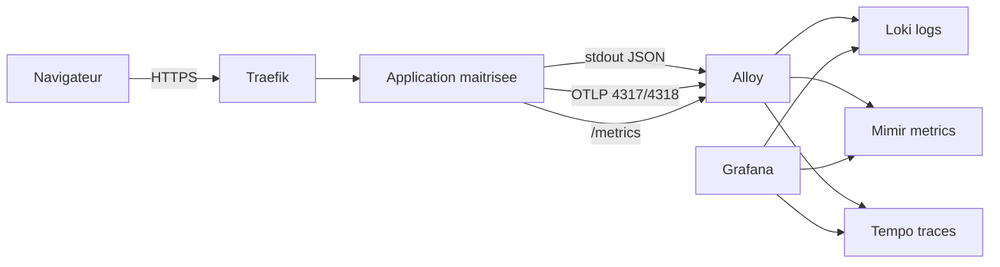

# Rapport Phase 5 - Plan applicatif LGTM revise

Date: 2026-07-07

## Objectif

Planifier la prochaine iteration applicative sans deployer d'application externe non maintenue.

La Phase 5 reste utile: la stack LGTM doit recevoir de la telemetrie applicative representative pour stabiliser Loki, Mimir, Tempo, Alloy et Grafana. La difference est que cette telemetrie devra venir d'une application maitrisee.

## Reference conservee

`open-telemetry/opentelemetry-demo` reste la reference de conception pour:

- les conventions de nommage OpenTelemetry;
- l'export OTLP;
- la correlation logs/traces/metriques;
- la structure des dashboards applicatifs;
- les patterns de propagation de contexte.

Elle n'est pas deployee par `Deploy_LGTM`.

## Architecture HLD

## Lots de l'iteration

### Lot 1 - Choix applicatif

- choisir une application interne ou un fork maitrise;
- definir le namespace cible;
- definir le nom DNS;
- confirmer le modele TLS;
- confirmer les secrets necessaires.

### Lot 2 - Instrumentation

- logs JSON sur stdout;
- traces OTLP vers Alloy;
- metriques applicatives exposees pour scrape;
- propagation `trace_id`;
- absence de donnees sensibles dans logs et labels.

### Lot 3 - GitOps

- manifests ou chart applicatif;
- Argo CD Application dediee;
- `NetworkPolicy` default deny + allowlists;
- secrets sous forme `SealedSecret`;
- dashboard Grafana applicatif.

### Lot 4 - Validation LGTM

- logs visibles dans Loki;
- metriques visibles dans Mimir;
- traces visibles dans Tempo;
- dashboard Grafana non vide;
- Argo CD `Synced/Healthy`;
- scan securite propre ou exceptions documentees.

## Criteres Go

- application maitrisee;
- image epinglee;
- secrets geres hors Git puis scelles;
- flux reseau cartographies;
- instrumentation inspiree des conventions OpenTelemetry Demo;
- rollback GitOps documente.

## Criteres No-Go

- application externe non maintenue;
- dependances non scannees;
- credentials dans `ConfigMap`;
- logs contenant tokens, cookies ou donnees personnelles;
- impossibilite d'exporter OTLP vers Alloy;
- NetworkPolicies non definies.

## Definition of Done

- application maitrisee accessible via Traefik;
- Loki recoit les logs applicatifs;
- Mimir recoit les metriques applicatives;
- Tempo recoit les traces;
- Grafana affiche le dashboard applicatif;
- la documentation d'exploitation et de securite est mise a jour.
