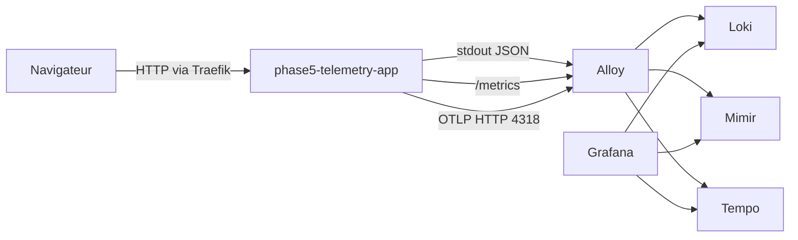

# Rapport Phase 5 - Plan de test complet

Date: 2026-07-08

## Objectif

Lancer la stabilisation production legere avec une application temoin maitrisee et un harnais OTLP de bout en bout.

Le perimetre Phase 5 couvre:

- application web maitrisee `phase5-telemetry-app`;
- logs JSON collectes par Alloy depuis Kubernetes;
- metriques Prometheus scrapees par Alloy et poussees vers Mimir;
- traces OTLP/HTTP envoyees vers Alloy puis Tempo;
- dashboard Grafana dedie;
- NetworkPolicies default-deny et allowlists explicites;
- plan de test unitaire, global, stress, charge et regression.

## Architecture de test



## Ressources creees

| Ressource | Role |
| --- | --- |
| `phase5-telemetry` | Namespace dedie a l'application temoin. |
| `phase5-telemetry-app` | Application Node.js maitrisee, sans dependance npm externe. |
| `phase5-telemetry-source` | Code source applicatif embarque en `ConfigMap`. |
| `phase5-telemetry-app` Service | Exposition interne sur TCP 3000. |
| `phase5-telemetry-app` Ingress | Acces via Traefik sur `phase5-app.example.local`. |
| NetworkPolicies `phase5-*` | Default deny, DNS, Traefik, Alloy OTLP et scrape metrics. |
| Dashboard Grafana | `Deploy_LGTM Phase 5 Telemetry Overview`. |

## Tests unitaires

| Test | Commande | Attendu |
| --- | --- | --- |
| Healthcheck | `GET /healthz` | `ok` |
| Page HTML | `GET /` | page Phase 5 servie |
| Trafic nominal | `GET /api/work` | JSON `status=ok` avec `trace_id` |
| Erreur controlee | `GET /api/error` | HTTP 500 controle avec `trace_id` |
| Metrics | `GET /metrics` | compteurs `phase5_*` |

## Tests globaux LGTM

| Backend | Verification | Requete indicative |
| --- | --- | --- |
| Loki | logs JSON applicatifs visibles | `{pod=~"phase5-telemetry-app.*"} |= "trace_id"` |
| Mimir | metriques scrapees par Alloy | `up{app="phase5-telemetry-app"}` |
| Mimir | trafic applicatif | `rate(phase5_http_requests_total{app="phase5-telemetry-app"}[5m])` |
| Tempo | traces recues via OTLP | recherche service `phase5-telemetry-app` |
| Grafana | dashboard non vide | `Deploy_LGTM Phase 5 Telemetry Overview` |

## Tests de stress

Objectif: verifier que l'application, Alloy et les backends LGTM restent stables avec une generation rapide d'evenements.

Plan:

1. Generer des appels repetes sur `/api/work`.
2. Injecter un ratio controle d'appels `/api/error`.
3. Observer CPU/RAM/restarts des pods `phase5-telemetry`, `alloy`, `loki`, `mimir`, `tempo` et `grafana`.
4. Observer les compteurs `phase5_otlp_traces_sent_total` et `phase5_otlp_trace_failures_total`.

Critere de sortie:

- pas de CrashLoopBackOff;
- pas de progression anormale des erreurs OTLP;
- dashboard Grafana exploitable pendant le test;
- Loki/Mimir/Tempo restent interrogeables.

## Tests de charge

Objectif: utiliser une charge moderee sur 24h pour ajuster ressources, retention et NetworkPolicies.

Mesures:

- CPU/RAM des pods LGTM;
- latence de requete Grafana;
- volume logs Loki;
- cardinalite et series Mimir;
- disponibilite Tempo;
- restarts et events Kubernetes.

Critere de sortie:

- ressources ajustees;
- aucune saturation PVC evidente;
- alertes essentielles proposees ou creees;
- runbook d'exploitation mis a jour.

## Tests de regression

Avant chaque changement Phase 5:

```powershell
.\scripts\Test-Repository.ps1
```

Apres synchronisation Argo CD:

```powershell
.\scripts\phase5\Test-Phase5Telemetry.ps1
kubectl -n argocd get applications
kubectl -n phase5-telemetry get pods,svc,ingress,networkpolicy
kubectl -n observability get pods
```

Regression fonctionnelle attendue:

- application accessible via Traefik;
- logs visibles dans Loki;
- metriques visibles dans Mimir;
- traces visibles dans Tempo;
- dashboard Grafana non vide;
- aucun secret en clair ajoute au repo.

## Notes de validation runtime

Lors du lancement initial:

- Mimir expose bien `phase5_http_requests_total`;
- Tempo retrouve des traces avec `rootServiceName=phase5-telemetry-app`;
- Loki necessite que Alloy puisse interroger l'API Kubernetes pour decouvrir les pods et collecter leurs logs.

Le flux `alloy -> API Kubernetes` est donc autorise explicitement par NetworkPolicy dans `observability`.

## Execution du 2026-07-08

Etat GitOps:

- `phase5-telemetry`: `Synced` et `Healthy`;
- `alloy`: `Synced` et `Healthy`;
- `grafana`: `Synced` et `Healthy`;
- `observability-network-policies`: `Synced` et `Healthy`.

Validation runtime:

- smoke test `scripts/phase5/Test-Phase5Telemetry.ps1`: OK;
- `GET /healthz`: OK;
- `GET /api/work`: OK, generation d'un `trace_id`;
- `GET /api/error`: OK, erreur 500 controlee;
- Mimir: OK sur `phase5_http_requests_total`;
- Tempo: OK sur les traces du service `phase5-telemetry-app`;
- Loki: OK avec `{namespace="phase5-telemetry"} |= "trace_id"`, `{pod=~"phase5-telemetry-app.*"} |= "trace_id"` et `{app="phase5-telemetry-app"} |= "trace_id"`.

Correction appliquee pendant le lancement:

- Alloy collectait bien les logs via `loki.source.kubernetes`, mais les logs de pods n'etaient pas etiquetes avec `namespace`, `pod`, `container` et `app`.
- La configuration a ete alignee sur le modele officiel Grafana Alloy: `discovery.kubernetes` -> `discovery.relabel` -> `loki.source.kubernetes` -> `loki.write`.
- Le filtrage `spec.nodeName` a ete ajoute pour qu'un pod Alloy en DaemonSet ne collecte que les pods de son noeud.
- Apres redemarrage controle du DaemonSet Alloy, les logs Phase 5 sont visibles dans Loki avec les labels Kubernetes attendus.

Point hardening observe:

- Le redemarrage Alloy declenche un avertissement Pod Security Admission `restricted` sur les conteneurs du chart Alloy.
- Ce point n'est pas bloquant pour la Phase 5, mais il doit rester dans le backlog de durcissement Helm values avant passage production exposee.

Reference technique:

- Grafana Alloy, collecte de logs Kubernetes: `https://grafana.com/docs/alloy/latest/collect/logs-in-kubernetes/`.

## Risques et limites

- Le chemin MySQL reel n'est pas encore deploye: il necessite des credentials sous forme `SealedSecret`.
- L'application Phase 5 actuelle valide le chemin web/logs/metrics/traces, puis le lot MySQL sera ajoute apres preparation des secrets.
- Les tests de stress et de charge doivent etre lances depuis l'environnement cluster, pas depuis CI.
- Le DNS `phase5-app.example.local` doit etre adapte localement hors Git si un acces navigateur est requis.
